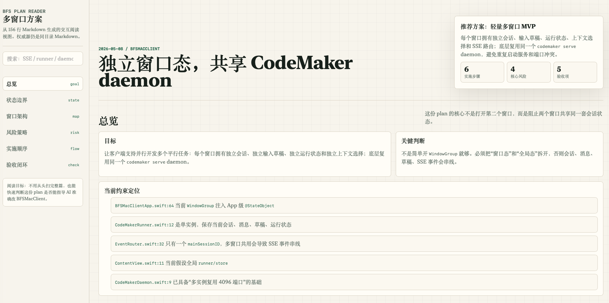
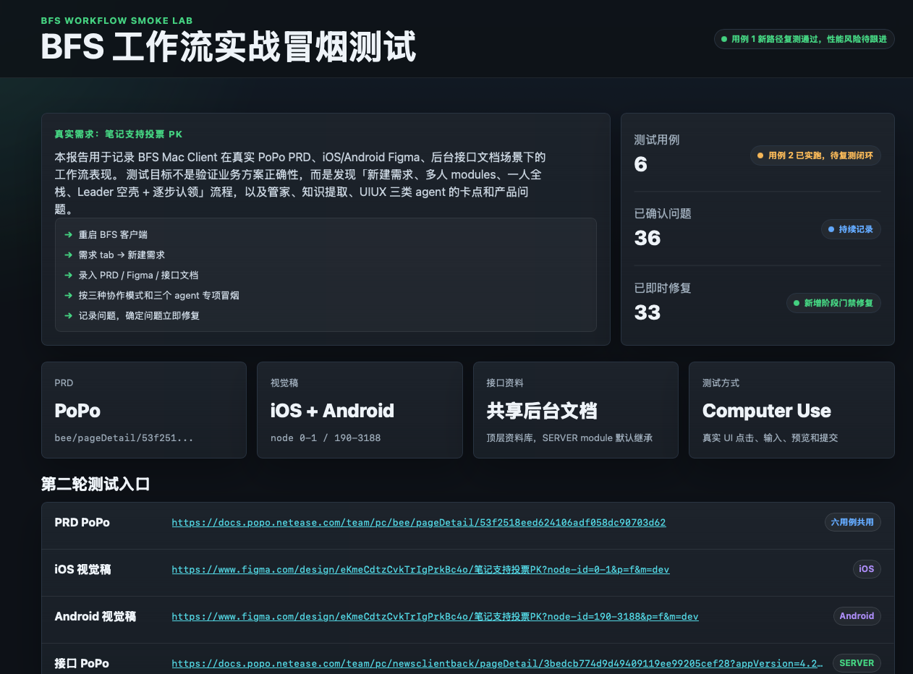
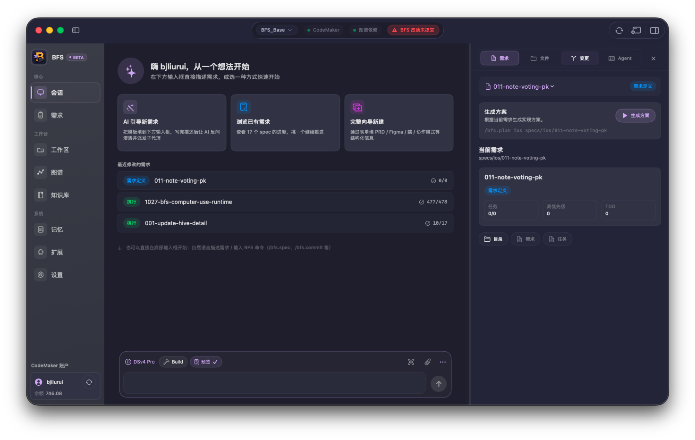

## 先说结论

**全面拥抱 AI 不等于全面跟风 AI。**

这段时间我刷了大量 X、YouTube、小红书，再加上一些一线 AI 视频博主的解读，差点真的相信了两件事：

1. **HTML 要全面代替 Markdown**，AI 写文档以后都该输出 HTML。
2. **GUI 的天塌了**，未来都是 Agentic CLI，桌面 App 是上一个时代的眼泪。

但当我把这两件事真的搬到 BFS 工作流里、搬到自己每天的开发节奏里之后，得到了两个相反的答案：

1. **HTML 在「冒烟测试」「Plan 阅读视图」这种特定场合，确实解决了「我不想读、我懒得读」的真问题；但塞进 SDD 主流程做 SSoT，反而是个累赘。**
2. **CLI 极客玩得很爽，普通人用得很痛苦。Codex / Claude Code / 国内一票 Coding Agent 反过来都在卷桌面 App、卷 Chrome 插件、卷 Computer Use —— 这恰恰说明 GUI 不是过时，而是 AI 的「易用性入口」。**

一句话：

**追二手消息很容易焦虑，但适合自己工作流的，才是真的好东西。**

## 前言：焦虑是怎么来的

最近一段时间，AI 行业的节奏是这样的：

- 早上刷 X，看到 OpenAI 又发了一个 0.x 版本，配一张截图、一句「game changer」。
- 中午刷 YouTube，[AI 超元域](https://www.youtube.com/@AIsuperdomain)、[Matthew Berman](https://www.youtube.com/@matthew_berman)、[All About AI](https://www.youtube.com/@AllAboutAI)、[Fireship](https://www.youtube.com/@Fireship) 几个一线博主轮流出片，标题清一色「This Changes Everything」。
- 下午刷小红书，「不学就被淘汰」「程序员请立刻 All In」「3 个 AI 工具吊打 Cursor」横着躺在首页。
- 晚上又刷到一条小红书博主泼冷水：「这只是 demo，落地还差十万八千里」。

四种情绪反复轮播，结果就是：**总觉得自己跟得太慢，又总怀疑别人是不是吹得太狠。**

这篇文章是两次「停一下」的真实记录：HTML 替代 Markdown，和 Everything CLI。两次我都差点跟风，又都被自己拽回来。

## 案例一：HTML 全面代替 Markdown？看场合

### 1.1 跟风原点

5 月初 Claude Code 团队 Thariq Shihipar 写了一篇关于 HTML 输出的爆款文章，Simon Willison 又转述了一次：[Using Claude Code: The Unreasonable Effectiveness of HTML](https://simonwillison.net/2026/May/8/unreasonable-effectiveness-of-html/)。

那句金句很有杀伤力：

> **HTML 不是输出格式，是 chat 的外接 GUI。**

我承认我也心动过。BFS 里 `plan.md` 动辄 1000 行，团队成员真的会读完吗？还是滑到底点批准？如果 HTML 能让人「愿意读」「读得懂」，那不就解决了 BFS 最痛的一环 —— 人类 review 完成率？

### 1.2 落地：BFS Plan HTML 阅读视图实验

我没有停留在观点争论。那一周我和 Codex 一起做了一个真实实验。

**选的样本**：BFSMacClient 多窗口方案 `BFSPlanMode/2026-05-08-bfsmacclient-multi-window.md`，原始 156 行 Markdown。这个 Plan 不算长，但已经塞满了「对人脑不友好」的信息：

- 哪些对象全局共享、哪些对象窗口独立（`BFSStore / CodeMakerRunner / EventRouter` 的边界）
- `BFSMacClientApp → BFSWindowRootView → BFSWindowContext → ContentView → SSE` 的调用链
- 多窗口 SSE 会不会串线
- 关闭窗口、关闭 App 对 daemon 生命周期的影响
- 实施顺序和验收方式

我们把它生成成了一个 ~1070 行、自包含 CSS/JS 的交互 HTML 阅读视图，配齐这些交互：章节导航、搜索框、架构节点点击查看职责、风险按维度过滤、验收 checklist 可勾选、一键复制实现提示词。本地 Chrome 打开，效果非常直观。



#### ✅ 实验里 HTML 真的赢了的三件事

**一、HTML 能把「关系」从文字里解放出来。** Plan 最难读的不是结论，是关系：A 是全局态、B 是窗口态、A 调 B、B 注入 C、先改 RootView 再改 Context。Markdown 能写清楚，但全压成段落。HTML 可以把这些关系拆成可视对象——这恰好命中 BFS 的痛点：**AI 写错代码经常不是不知道「要做什么」，而是搞错了「谁属于谁、谁不能共用」。**

**二、HTML 真的提高了长 Plan 的阅读兴趣。** 1000 行 Plan 哪怕内容正确，逐行读也很累。HTML 视图可以让人先看一屏摘要，再按兴趣展开细节。这不是为了好看，是为了**降低 review 的心理成本**。

**三、HTML 适合做「AI 防错面板」。** 状态边界（全局单例 vs 窗口独立）、风险策略（会话隔离 / daemon 生命周期 / 仓库并发）、验收闭环（`swift build` / `swift test` / 双窗口不串线）——这些恰好都是 AI 最容易犯错的地方。把它们从段落里抽出来做成 HTML 块，相当于**把「不能猜的地方」放到了台面上**。

#### ❌ 但 HTML 想当源文件，立刻翻车

**真正的危险藏在一句话里：Markdown 长文本来就有「没读懂也能批准」的问题——AI 一口气写 1000 行 Plan，人扫一眼标题、滑到最后点批准。** HTML 如果只是把长文换成漂亮卡片，会**继承**这个误批准问题，甚至让它更隐蔽，因为「按钮看起来像确认，其实只是本地状态」「颜色表达了不存在的优先级」「真风险藏在折叠区」。

更现实的几个代价：

- **diff 失去意义**：156 行 Markdown 变成 ~1070 行 HTML/CSS/JS，git diff 里看不出真正的需求变化在哪。
- **token 成本飙升**：BFS 不是一次性玩具，spec/plan 要被 Codex/Claude/CodeMaker 一遍遍读取归档回流。源文件改 HTML 等于每次读取都为标签和样式付钱。
- **「界面即事实」幻觉**：HTML 编辑器里勾的、改的、排序的，**不是 BFS 状态**。只有回写到 `spec.md / plan.md / tasks.md` 才算进入工作流。

#### 这次实验给 BFS 留下的规则

| 阶段 | HTML 适不适合 | 怎么用 |
|------|---------------|--------|
| spec.md | 源文件不动 | 超过 100 行时可生成轻量 HTML 摘要视图，高亮「待澄清」 |
| plan.md | 源文件不动 | **最适合生成 HTML 阅读视图**，超 100 行 / 多端 / 多状态边界自动触发 |
| tasks.md | 不建议 HTML 化 | 必须保持可 diff、可 grep |
| archive.md | 源文件不动 | 可生成对外 `archive-report.html` 做团队分享 |

一句话总结：

> **`spec.md`、`plan.md`、`tasks.md`、`archive.md` 继续作为 BFS 唯一权威源；HTML 只允许作为可生成、可丢弃、可回流的阅读视图。HTML 里形成的任何结论、勾选、排序、验收状态，必须回写 Markdown 才算数。**

这条规则也直接给出了下一步：做一个固定的 Plan Reader 生成器（`scripts/bfs-plan-view.sh`），稳定提取目标 / 约束 / 状态边界 / 实施顺序 / 风险 / 验收清单，输出固定模板的 HTML——比每次让 AI 自由发挥可靠得多。

### 1.3 BFS 真实印证：冒烟测试 HTML 救了我

最有意思的是另外一个角度。BFS 五段开发流里，最容易被偷懒的不是 spec，不是 plan，是 **冒烟测试报告**。

以前我们的 smoke 报告是 `.md`：

```
BFSTest/codemaker-concurrency-smoke-report-20260527.md
BFSTest/pk-vote-real-interaction-20260128-smoke/
BFSTest/restored-a02-figma-artifacts-20260527/
```

打开就是一堵字。我自己写的，三天后我都不想再看一遍。

后来我们改成 HTML 报告（典型例：`BFSTest/bfs-figma-extraction-smoke-report.html`），加上结构化卡片、状态色、可折叠区，效果立刻不一样：

- 自己愿意复盘了。
- 同事愿意点开看了。
- 走查路径可以一眼扫过去，红的就是要修的。



这就是 HTML 真正合适的场合：**给「人」看的临时阅读视图，不进事实源。**

### 1.4 但 SDD 主流程里 HTML 反而碍事

转头看 BFS 的 spec / plan / tasks，我反复体会下来，HTML 真不合适：

- **diff 噪声**：Plan 改一句话，HTML 改三百行样式。code review 还要不要做？
- **AI 反复读**：BFS 里 spec.md 会被 Codex / Claude / CodeMaker 一遍遍读，HTML token 成本难以承受。
- **批准失真**：人喜欢「按钮看起来像确认」，但 BFS 真正的批准依据必须能 grep、能追溯，HTML 做不到。

所以最后我定的规矩很朴素：

> **Markdown 负责事实，HTML 负责理解。源文件不变，视图可丢，结论回流。**

这条规矩不是从二手消息抄来的，是我把 HTML 真的塞进 BFS 工作流之后才得到的。Thariq 和 Simon 没错，但**他们的场景不是我的场景**。

## 案例二：Everything CLI？普通人需要的是 GUI 易用性

### 2.1 跟风原点

4 月开始 X、YouTube、小红书上同时冒出来一种很时髦的口径：

> **The App Is Dead. Agentic CLI Killed the GUI in 2026.**

这种内容我刷到不下三十次：YouTube 上 [Fireship](https://www.youtube.com/@Fireship) 一条「Claude Code in 100 Seconds」拍得很燃，小红书上「告别 IDE，全终端开发」的笔记一刷一大把。说法都很类似：

- IDE 边栏插件已死。
- 桌面 App 是上一个时代的产物。
- 真正的 AI 工程师都在终端里完成所有事情。
- CLI = 极客 / 高效 / 未来；GUI = 小白 / 低效 / 过去。

那段时间我一度怀疑 BFSMacClient 是不是做错方向了。我们做了大半年的桌面客户端，要不要砍掉、回到纯 CLI？

也是那段时间我让一个不写代码的朋友试了一下 Claude Code CLI。他在终端里输入命令的速度，跟我学 Vim 第一周差不多。

我当时就知道这事儿不对。

### 2.2 反向证据：所有 CLI 工具都在做 GUI

我把焦虑放一边，去看了一遍那些「Agentic CLI 杀手」的厂商最近在干什么：

- **OpenAI Codex**：5 月 7 日发布 [Codex Chrome Extension](https://developers.openai.com/codex/app/chrome-extension)，让 Codex 直接在 Chrome 里跑；同期推出 [虚拟宠物 /pet](https://www.mindstudio.ai/blog/openai-codex-3-new-features-chrome-plugin-pets-goal)，加上桌面 App 升级。CLI 那边也没停，但**主推都是桌面+浏览器**。
- **Claude Code**：从 CLI-first 演变成「CLI + 桌面 App（Mac/Windows）+ Web 应用 + IDE 扩展」全家桶。我们都在用的 fast mode 是桌面 App 里点出来的。
- **国内 AI Coding Agent**：龙虾、通义灵码、Cursor 之类，几乎全部都有自己的桌面客户端、IDE 插件或浏览器扩展，没有谁纯纯只剩一个 CLI。

如果 CLI 真的杀死了 GUI，这些团队不会反过来花最多精力卷桌面端、卷 Chrome 插件、卷 Computer Use。这是一个非常朴素的反向证据：

> **嘴上喊 CLI 万岁的是博主，真金白银投 GUI 的是厂商。**

参考文章里这段判断我觉得很到位：

> AI coding agents are moving out of IDE sidebars into **desktop apps, CLIs, and cloud sandboxes**，which makes long-horizon tasks and parallel agents easier to run and monitor.（[Augment 2026 排行](https://www.augmentcode.com/tools/best-ai-coding-agent-desktop-apps)）

注意是 desktop apps **and** CLIs，不是 CLI killed GUI。

### 2.3 真实工位印证：Codex 最近三件「持续增强」

我自己最近半个月很真实的使用感受，三件事都在加强同一个判断：**AI 工具的价值越大，对易用性的要求越高，而易用性的天花板是 GUI 不是 CLI。**

#### 一、好玩的宠物 `/pet`

听起来像玩具，但意外地有用。

在 Codex 桌面 App 里 `/pet` 唤出一个小宠物，`/hatch` 还能 AI 生成自定义形象。我一开始也觉得这是博眼球，但用了一周之后发现：

- 长任务跑后台时，宠物在角落晃，能直观告诉我「它还活着」。
- 多 session 并发时，宠物状态对应不同的 agent，瞄一眼就知道哪个 agent 卡了。
- 心理上很奇妙地降低了「孤独编程」的焦虑感。

这种东西**只能在 GUI 里成立**。CLI 里你给我画个像素宠物试试？立刻把整个体验拉回上世纪 90 年代。

#### 二、强大的 Chrome 插件

[Codex for Chrome](https://chromewebstore.google.com/detail/codex/hehggadaopoacecdllhhajmbjkdcmajg) 是 5 月最让我惊喜的功能。它跑在我自己的 Chrome profile 里，复用我已经登录的所有会话：Gmail、Jira、Confluence、Figma、Grafana……

我让它做过这些事：

- 打开 Figma 评论页，把所有「未解决」过一遍，转写成走查清单。
- 打开 Jira 看板，按我名下未关闭项目按优先级摘要。
- 打开 Confluence 长文，跨页面汇总然后回写到 BFS spec.md。

如果这事用 CLI 做，我得先解决登录、cookie、MCP server、token 漂移、二次验证一大堆破事。Chrome 插件直接用我「人」已经登录好的状态，**零摩擦**。

#### 三、实用的 Computer Use：把 Jira 链接丢给它，完全解放双手

这是最近最让我「相信 GUI 有未来」的体验。

我现在的真实工作流，就一句话：

> 把 Jira 链接发给 Codex，让它读 bug、定位代码、改完、跑一遍、报给我看。

具体场景大概是这样：

1. 我把一个 Jira 链接粘进 Codex。
2. 它用 Computer Use 打开 Jira，读完描述、复现步骤、截图、评论。
3. 它对照截图自己判断需要改 iOS / Android / Server 哪个端。
4. 用 graphify 定位类，进入子仓库改代码。
5. 跑 smoke，回来告诉我「改完了，要不要看看」。

整个过程我可以去喝杯咖啡。

这种「把链接丢过去，完全解放双手」的体验，**靠 CLI 复刻不了**。CLI 里你最多能贴一个 Jira ID，工具还得反过来问你「请粘贴 bug 内容」「请提供截图路径」—— 焦虑感立刻就回来了。

参考文章里有一段我感同身受：

> The agent now drives your actual Chrome profile, so it can update Salesforce, search Gmail, or scrape an internal Grafana dashboard **without you handing over credentials**.（[OpenAI Codex May 2026 updates](https://authorityaitools.com/blog/openai-codex-may-2026-chrome-extension-cli-0129)）

凭证不用交、状态不用搬、工具不用重新登 —— 这才是真正的「AI 作为工具的易用性」。

### 2.4 BFS 真实印证：BFSMacClient GUI 的明显优势

回到 BFS 自己的工作流。BFS 是一个明显「**编排型**」的工作流：

- 五段开发：spec → plan → tasks → implement → archive。
- modules 多人协作：一个父需求挂多个 module，每人独立切片。
- 多端联动：iOS / Android / Server / Web / H5 并发跑。
- 知识回流：bugs.md / knowledge.md / extractor / steward 一堆产物。
- Graphify、智能体调度、子代理 wave 编排……

这种工作流如果纯 CLI，我每开一个 module / 一个端 / 一个 agent 都得开一个终端窗口。三个 module × 五个端 = 一屏铺满终端，谁也分不清哪个是哪个。

BFSMacClient 桌面端不是为了「好看」存在的，它解决的是 BFS 真正的痛点：

- **多窗口隔离**：每个需求一个窗口，每个 module 一个会话，互不串线。
- **状态面板**：tasks 进度、smoke 状态、子代理输出、bugs 列表一屏可见。
- **健康并入设置导航**、**可折叠侧边栏**、**Chrome 自适应表面**（最近几个 commit 的方向）。
- **流式输出**：SSE 推过来一段就显示一段，可以一边读一边追问，CLI 滚屏看完早就忘了上下文。



这才是 GUI 的真正价值：**承载编排型工作流，让人能「看见」复杂度，而不是被复杂度淹没。**

## 两次「停一下」教会我什么

把 HTML 案例和 CLI 案例放一起，能抽出一个共同模式：

| 阶段 | 二手消息说的 | 我真实落地后发现的 |
|------|--------------|--------------------|
| 观察 | HTML 全面代替 MD | HTML 只在「阅读视图」「冒烟报告」赢 |
| 观察 | CLI killed GUI | 厂商真金白银在卷桌面 App + Chrome 插件 + Computer Use |
| 落地 | 跟风全切，下个月再切回去 | 找到「场景边界」，让两者各做各的强项 |

二手消息有它的价值，它帮你**知道**世界在发生什么。但真正决定你工作流的，永远是「**在我自己的场景里跑一遍**」这一步。

所以我给自己定了一个新的「焦虑过滤器」：

1. **观察归观察，先别动手改 BFS 工作流。**
2. **找一个 BFS 里最小、最可控的真实场景试一次。**
3. **试完看「成本-收益-可逆性」三件套，不行就回滚，不丢人。**
4. **把过程写成一篇 BFSLearning 复盘**，避免下一个同事重走一遍。

这一套下来，焦虑明显少很多。**学得慢不是落后，学得糙才是。**

## 最后一句

AI 时代不缺新东西。缺的是**停下来问一句「这玩意儿到底解不解我的问题」**的耐心。

学得慢不是问题，**没有自己的场景**才是。

如果你只刷不试，永远是焦虑的。
如果你刷了又试了，剩下的就是判断力。

我打算继续慢慢学，但每一步都让 BFS 真的更好用一点。

## 参考链接

- 上一篇 BFS HTML 实验：《HTML 代替 Markdown？一次 BFS Plan 阅读视图实验》
- Simon Willison 转述：[Using Claude Code: The Unreasonable Effectiveness of HTML](https://simonwillison.net/2026/May/8/unreasonable-effectiveness-of-html/)
- Codex Chrome Extension 官方页：[Codex Chrome extension – OpenAI Developers](https://developers.openai.com/codex/app/chrome-extension)
- Codex 三新功能（Chrome / Pet / Goal）：[OpenAI Codex Got 3 New Features This Week](https://www.mindstudio.ai/blog/openai-codex-3-new-features-chrome-plugin-pets-goal)
- Codex May 2026 更新汇总：[OpenAI Codex May 2026 updates](https://authorityaitools.com/blog/openai-codex-may-2026-chrome-extension-cli-0129)
- 桌面 App 排行（佐证 GUI 没死）：[9 Best AI Coding Agent Desktop Apps in 2026 — Augment](https://www.augmentcode.com/tools/best-ai-coding-agent-desktop-apps)
- 对立观点（CLI killed GUI）：[The App Is Dead — AI.cc](https://www.ai.cc/blogs/the-app-is-dead-agentic-cli-killed-gui-2026/)
- 上一次类似复盘：《GitNexus vs Graphify：全栈知识库双引擎调研》
