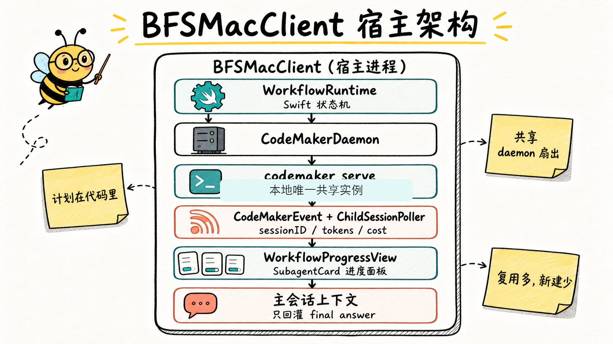
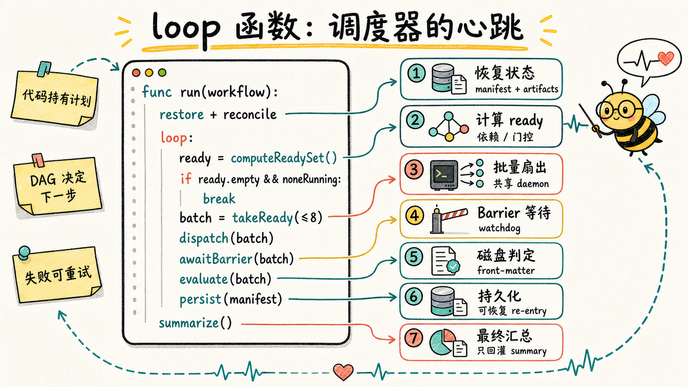
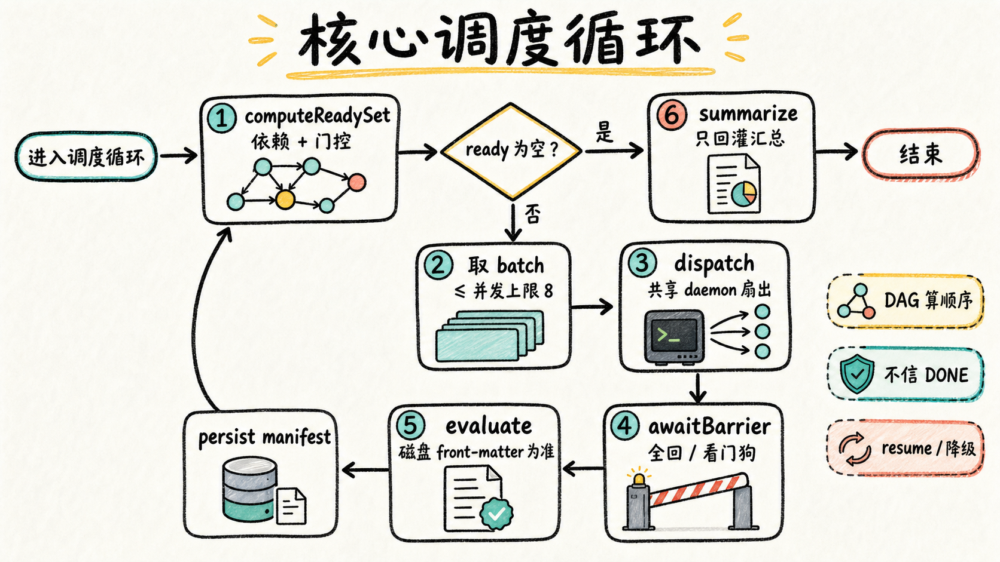
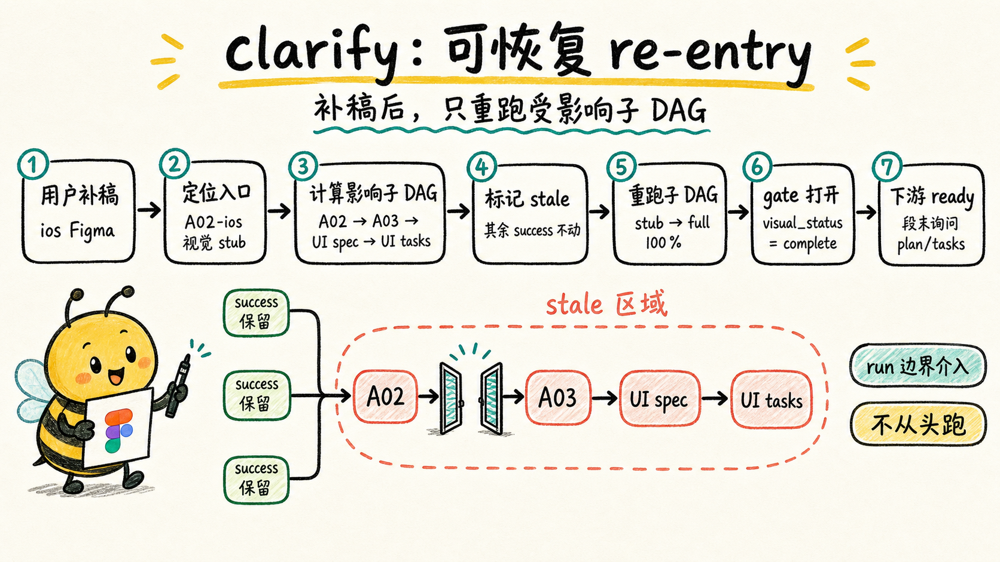

2026-05，Claude Code 发布了 **Dynamic Workflows**：把编排计划从模型上下文搬进代码，由 runtime 扇出大量子代理。这套机制击中了 BFS 一直在用提示词硬扛的所有痛点。

本文先说我最近这段时间做全栈需求的几条真实体会，再讲清楚两件事：Claude Code 动态 Workflow 到底是什么、为什么重要；以及 BFS 怎么基于 CodeMaker CLI 复刻出一套**寄宿在 BFSMacClient 里的自定义 SDD 编排 runtime**，附上 P0 实测踩的坑、核心调度循环和架构图。

---

## 先说结论

**AI Agent 现在还单挑不了大需求，但你可以给它包一层自己的 Harness，让它稳定地打小怪。**

这段时间我用 Codex / Claude Code / CodeMaker 真刀真枪做了不少全栈需求，踩了很多坑，也想明白了几件事。先把结论摆出来，后面再展开为什么。

**1. AI Agent 目前无法很好地单挑大需求，包括全栈需求，最佳实践是把需求拆小。**
我依然感觉现在的 Coding Agent 很像《曼达洛人》里的「古古」（Grogu）：原力强大、潜力无限，但需要耐心和它配合。

**2. 视觉文件的消化（比如 Figma 提取）是前端开发极其重要的一环，但也是 AI 目前最吃力的一环。**
对很多需求来说，实现出来的页面跟设计稿对不上，再谈什么「AI 正确率」都没有说服力——页面都不对，正确率是个伪命题。而大型 Figma 文件的提取效率极低，受限于模型能力和上下文窗口；更糟的是，**传统 SDD 产物里压根没有一份可留存、可复用的 md 视觉参考**，每次都得重新喂、重新提。这恰恰印证了第 1 条：视觉这种重活，也得拆小、得有专门的环节兜着。

**3. 自定义工作流是必要的，甚至因人而异。**
本文介绍的只是**一种思路**，不是标准答案。每个人都可以有自己特色的编排工作流：无论是改造传统 SDD 流程、在关键步骤里塞「伪钩子」做强制校验，还是持续完善知识库——这些都是实打实提升 AI 正确率的办法。

**4. 善用已有 Coding Agent 的能力，再包一层自己的 Harness 工程，可以极大提升代码实现的正确率。**
不要试图重造一个 Agent。CodeMaker / Claude Code 已经把「单 Agent 干活」这件事做得很好了，你要做的是**在它外面包一层属于自己业务的编排骨架（Harness）**——把「谁先谁后、谁等谁、什么时候算完成、卡死了怎么办」这些纪律从「靠模型自觉」变成「靠代码强制」。这一层包对了，正确率的提升是肉眼可见的。

**5. 靠 Prompt 派发子代理，会出现主 Agent 忽略指令、编排偷懒、自由发挥等问题；但自定义 Workflow 把这个痛点直接修掉了。**
过去 BFS 靠近千行提示词去约束「派 5 个子代理、跨 Barrier 串行、跑到质量门槛再下一步」，但模型总会偷懒：说派 N 个实际只派 1 个、该并发的串行接龙、甚至自己 Edit 冒充子代理产物。**而当编排活在代码里、由 runtime 物理执行时，这些偷懒手段根本没有发生的空间**——子代理协作的可靠性立刻就上来了。这是我做这套 runtime 最大的收获。

---

## 前言：BFS 的编排，一直活在提示词里

BFS 是个典型的**编排型**工作流：五段开发（`spec → plan → tasks → implement → archive`）、多端联动（iOS / Android / Server / Web / H5）、modules 多人协作、知识回流、子代理 wave 编排……

但 BFS 当前这套并发编排（并发 ≤5、Barrier 同步、Resume-until-quality-gate、降级/BLOCKED、MCP 缓存），**本质全部活在主 Agent 的上下文窗口里**，靠大约 850 行提示词 + 自检清单去强制执行。

这就埋下了上面结论第 5 条的病根。提示词写得再细，模型该偷懒还是偷懒。而**把计划从上下文搬进代码**，似乎是一个不错的解决思路。

---

## 一、Claude Code 动态 Workflow 是什么

它不是「一个更聪明的 Agent」，而是与 **Subagents / Skills 并列的第三种编排原语**。三者的核心区别只在于：**谁持有计划、中间结果存在哪里。**

| | Subagents | Skills | **Workflows** |
|---|---|---|---|
| 是什么 | Claude 派的 worker | Claude 遵循的指令 | **runtime 执行的脚本** |
| 谁决定下一步 | Claude 逐 turn | Claude 按提示 | **脚本本身** |
| 中间结果存哪 | **模型上下文** | **模型上下文** | **脚本变量** |
| 规模 | 每 turn 几个 | 同 subagent | **每次几十到上千 agent** |
| 中断后 | 重跑整个 turn | 重跑整个 turn | **同 session 内可 resume** |

一句话机制：**"A workflow moves the plan into code."**

Claude 当场写一段 JS 编排脚本，runtime 在后台隔离执行，循环 / 分支 / 中间结果全都活在脚本变量里，模型上下文只留最终汇总。由此单次可以跑 16 并发、上限 1000 个 agent 而不撑爆上下文；还能内建质量模式（多 agent 对抗式交叉复核、多角度起草再权衡）。

为什么这件事对 BFS 是「正中要害」？因为动态 Workflow 文档列举的每一个痛点，BFS 都正在挨：

1. **上下文膨胀**——每个子代理的结果都落回主 Agent 上下文（BFS 整章「MCP 大返回走缓存」就是在绕这个）。
2. **编排不可靠**——大篇幅提示词在堵「模型偷懒串行接龙」「说派 N 个实际只派 1 个」「自己 Edit 冒充子代理产物」。这些都是「计划靠模型自觉执行」的必然代价（呼应结论第 5 条）。
3. **并发被上下文卡死**——硬上限 5 不是 runtime 的限制，而是人类可读的上下文管不动更多。
4. **中断即重跑**——只能用 `completion_rate` 写进产物 front-matter 来模拟 resume，本质是在文件系统里手搓一张 runtime 状态表。
5. **那段 Python 伪代码**（`run_phase / dispatch / dispatch_resume / chunk_with_priority`）**其实已经是一份 workflow runtime 的规格说明书**，只是写成了「喂给模型假装执行」的伪代码。

> 结论很清楚：BFS 要的不是从零造能力，而是**把那段伪代码从提示词变成真代码 + 一个能扇出的 runtime**。这就是结论第 4 条说的「包一层自己的 Harness」。

---

## 二、P0 实测：先踩坑，再定架构

动手前我没急着写代码，先在本机用 CodeMaker CLI 做了三组实测。结论直接决定了架构方向——**这一步省不得：架构方向一旦选错，后面的实现全部推倒重来**。

### 2.1 ✅ 单 agent 无人值守，跑通

```bash
codemaker run "<prompt>" --format json <unattended-flag> \
  -m <low-cost-model> --title <tag> --dir <path>
```

- exit 0，耗时在可接受范围内；无人值守开关可以避免权限弹窗阻塞。
- 输出标准 JSON Lines：`step_start → text → step_finish`，事件里带会话标识、tokens 与 cost 摘要。
- **runtime 可以直接从 stdout 流里拿到 agent 的会话标识 + 实时 token/cost 摘要**。
- ⚠️ 成本基线：哪怕是 trivial prompt，单次启动也会有一笔固定 token 开销——这是**每个 agent 的冷启动成本**（system prompt + 工具定义）。扇出成本要按「每 agent 固定底 + 任务增量」来算。

### 2.2 ❌ 朴素扇出（N 个独立进程）会卡死

最自然的想法是「一 agent 一进程」，开 N 个 `codemaker run`。结果：**多个进程同时启动后长时间无输出、CPU 无明显活动**，并且都卡在同一类全局上下文资源上。日志形态大致是：

```
ERROR service=scheduler ... error=No context found for instance run failed
WARN  service=config ... dependency/plugin initialization failed
```

判断：**CodeMaker 的 "instance" 上下文更接近全局单例**。多个独立 `run` 进程并发启动会争用共享上下文，互相卡住，不产出也不报错退出。

### 2.3 ✅ 唯一可靠的扇出路径

实测验证过：**一个** `codemaker run` 内部通过 `task` 工具派多个子代理，child session 可以稳定创建并发运行——因为它们共享同一个 server/instance。

### 2.4 P0 总结论（决定架构的那句话）

> **不能「一 agent 一进程」扇出。唯一可靠的并发，是「单一共享 CodeMaker 实例内扇出」**——要么经共享服务接口创建 N 个 session，要么用 CodeMaker 原生 `task` 子代理机制（一父 N 子）。

这恰好**强化了「寄宿在 BFSMacClient」的方案**：BFSMacClient 本来就管理着那个唯一的共享 daemon（健康检查、心跳重启、优雅 dispose）。把 runtime 寄宿在这里，是顺着「全局单例 instance」这个硬约束走，而不是逆着它硬来。

---

## 三、架构：runtime 寄宿 BFSMacClient

核心思路概括起来就是：**新增一个编排状态机层，跑在 BFSMacClient 进程里，通过既有的共享 daemon 驱动 N 个 agent。计划（wave / barrier / resume / 分支）活在 Swift 代码里，不在模型上下文。**

```
┌──────────────────────── BFSMacClient (宿主进程) ────────────────────────┐
│                                                                          │
│   WorkflowRuntime (新增 · Swift 状态机)                                  │
│     · 加载 workflow 定义（半静态模板 + 任务参数）                        │
│     · 持有 loop / branch / 中间结果（= 伪代码落成真代码）                │
│     · Phase → Batch → Agent 调度，≤N 并发，Barrier，Resume，降级         │
│           │ 经共享服务接口派发 / 经 task 工具扇出                       │
│           ▼                                                              │
│   CodeMakerDaemon  ──►  codemaker serve（本地唯一共享实例）              │
│     （已存在：健康 / 心跳 / 重启 / dispose）                             │
│           │ JSONL/SSE 事件流（session / tokens / cost / tool state）      │
│           ▼                                                              │
│   CodeMakerEvent 解析（已存在） + ChildSessionPoller 观测（已存在）      │
│           │                                                              │
│           ▼                                                              │
│   WorkflowProgressView（复用 SubagentCard / 进度面板）                   │
│           │ 仅最终汇总回灌主会话                                         │
│           ▼                                                              │
│   主会话上下文（只留 final answer，不再被中间产物撑爆）                  │
└──────────────────────────────────────────────────────────────────────────┘
```



这套架构的关键在于**复用多、新建少**——这正是结论第 4 条「善用已有能力再包一层」的具体落点：

| 能力 | 现状 | 做法 |
|---|---|---|
| 唯一共享 CodeMaker 实例 | ✅ `CodeMakerDaemon` | 直接复用，扇出全走它 |
| Agent 事件解析（tokens/cost/tool） | ✅ `CodeMakerEvent` | 直接复用 |
| 子代理实时观测 | ✅ `ChildSessionPoller` | 直接复用；runtime 用它判 Barrier |
| 子代理 UI 卡片 | ✅ SubagentCard | 复用，扩 phase 分组 |
| **编排状态机（wave/barrier/resume/分支）** | ❌ 现只活在提示词 | **新建 `WorkflowRuntime`（本文核心增量）** |
| **workflow 定义 / 保存 / 复跑** | ❌ | **新建：半静态模板 + 参数** |
| **预算闸门 / 模型路由** | 部分 | **新建：token/cost 上限 + 低成本模型白名单** |

### 3.1 把「编排状态机层，跑在 BFSMacClient 进程里」这句话拆开

这一句压了好几层概念，逐个拆一下，整套架构就好懂了。

**① 跑在 BFSMacClient 进程里 —— 编排逻辑物理上住在哪。** 这是最容易被忽略、却最关键的一点。同样叫「编排」，住的地方完全不同：

| | 编排逻辑住在哪 | 谁在执行循环 |
|---|---|---|
| 老 BFS（提示词时代） | 模型的 context window | 模型逐 turn 自觉 |
| Claude Code 动态 Workflow | runtime 后台进程的 JS 沙箱 | Anthropic 的 runtime |
| **BFS 这套** | **BFSMacClient.app 自己的进程内存** | **我自己的 Swift 代码** |

「跑在 BFSMacClient 进程里」就是字面意思：调度循环在本机这个 app 的进程里执行（架构图里 `BFSMacClient (宿主进程)` 那个大框）。为什么非得寄宿在这——不是随便选的，是被第二节 P0 实测的「全局单例 instance」硬约束逼出来的：BFSMacClient 本来就独占管理着那个唯一的共享 daemon，编排循环必须跟它待在同一个进程，才能安全地「一父 N 子」扇出。

**② 状态机 —— 别被这词唬住，它就是「一张表 + 几条迁移规则」。** 那张表就是 `WorkflowRun.nodeStates`（`节点 id → 状态`），状态在 `pending → ready → running → success / partial / failed / blocked / gated` 之间迁移。关键认知：**这张表，就是老 BFS 里「活在模型上下文、靠提示词维护」的那张表**——现在搬进了 Swift 内存 + 磁盘 manifest，模型再也碰不到它，自然没法谎报「派了 5 个」「我 DONE 了」。（迁移规则的细节见 §4.3。）

**③「层」—— 它是一个调度循环，但循环里不写任何业务顺序。** 每一圈做的事：算谁能跑 → 并发上限内取一批 → 派出去等全回（barrier）→ 读磁盘真值判完成 → 落盘 → 再来一圈。最该记住的一点：代码里找不到一句「先跑 A02 再跑 A03」，先后 / 并发全由 `computeReadySet` 从 DAG 算出来。这也是「加新 workflow 只写新 Definition、调度器一行不改」的根源。（循环全貌见 §4.2。）

**④ 合起来，为什么叫它 Harness 而不是 Agent。** 这一层自己不思考、不写代码、不调模型，它只负责纪律：排队、并发控制、等齐、判完成、重试、记账、落盘；真正动脑干活的还是被它派出去的子代理。一句类比：**子代理是工人，这一层是工地的甘特图 + 监工**——而且是写死在 Swift 里、不会偷懒的监工，不是另一个会偷懒的 AI。创造性的活交给模型，确定性的纪律交给代码，这就是「包一层 Harness」最实在的含义。

### 3.2 半静态 workflow：不必让模型现写 JS

Claude Code 是「模型当场写 JS」。BFS 五段高度结构化，**不需要全动态**——更稳的是**半静态**：

- workflow 模板（wave / barrier / resume 逻辑）**固定为代码**。
- 只有任务参数（涉及端、Figma scope、tasks 切片）在发起时动态填充。
- 这样既拿到「计划在代码里」的全部好处，又避免「模型现写脚本」的不确定性与审计负担。

这点和结论第 3 条相互印证：**自定义工作流没有标准答案**——Claude Code 适合全动态，BFS 适合半静态，每个团队该按自己流程的结构化程度来选。

---

## 四、实现原理：一个 DAG 调度器

整个 runtime 的心智模型其实很简单：**它是一个「DAG 调度器」**——节点 = 一个子代理任务，边 = 依赖 / 门控关系。剩下的就是一个循环。

### 4.1 数据模型（先定名词）

```
WorkflowDefinition          # 半静态模板，定义「长什么样」
  └─ phases / nodes / edges（依赖边 + 门控边）

NodeSpec                    # 模板里的节点定义
  ├─ id            "A03-ios"
  ├─ subagentType  "bfs-knowledge-extractor"
  ├─ dependsOn     ["A02-ios"]                # 串行依赖边
  ├─ gates         [visual_status==complete]  # 条件门控边
  ├─ model         high | low                 # 受白名单约束
  └─ promptParams  {platform, figmaScope, ...}

WorkflowRun                 # 一次真实运行的活状态（核心）
  ├─ nodeStates  {id → NodeState}             # = 原来活在模型上下文的那张表
  ├─ budget      {tokensUsed, costUsed, limits}
  └─ persistedTo run-manifest.json            # 落盘支撑 stop/resume/冷重启 + 状态自愈

NodeState
  ├─ status          pending|blocked|gated|ready|running|success|partial|failed
  ├─ sessionID       session_xxx
  ├─ completionRate  0-100                     # 真值来源：磁盘产物 front-matter
  ├─ resumeCount     0-MAX_RESUME
  └─ lastProgressAt / lastLineCount            # 给 stuck 检测用
```

注意 `WorkflowRun.nodeStates` 这张表——它就是**原本活在模型上下文里、靠提示词维护的那张表**，现在搬进了 Swift 内存 + 磁盘 manifest。这一搬，结论第 5 条说的「模型偷懒、伪完成」就物理上没法发生了。

### 4.2 核心调度循环（整个 runtime 的心脏）

```
func run(workflow):
    run = restoreManifestIfAny(workflow)
    run = reconcileManifest(run, workflow.definition, artifacts)
    loop:
        ready = computeReadySet(workflow)         # ① 算谁能跑（依赖 + 门控）
        if ready.isEmpty and noneRunning(): break # 全终态 → 结束
        batch = ready.prefix(concurrencyLimit)    # ② 并发上限内取一批（起步 8）
        dispatch(batch)                           # ③ 经共享 daemon 扇出
        results = awaitBarrier(batch)             # ④ 等这批全回（或看门狗判死）
        for node in batch: evaluate(node)         # ⑤ 用磁盘 front-matter 判完成
        persist(workflow.run)                     # 落 run-manifest
        # 不在这里推进下游；下一轮 computeReadySet 自动放行
    summarize(workflow)                           # ⑥ 只把汇总回灌主会话
```



用流程图看更直观：



对应到文字版流程，大概是这样：

```
        ┌─────────────────────────────────────────────┐
        │              进入调度循环                      │
        └───────────────────┬─────────────────────────┘
                            ▼
              ┌──────────────────────────┐
              │ ① computeReadySet         │  依赖全 success + 门控满足
              │   算出此刻能跑的节点        │  + 自身未终态 → ready
              └────────────┬─────────────┘  否则 blocked / gated
                           ▼
                ready 为空 且 无 running？──── 是 ──► ⑥ summarize → 结束
                           │
                           否
                           ▼
              ┌──────────────────────────┐
              │ ② 取 batch（≤ 并发上限 8）  │
              └────────────┬─────────────┘
                           ▼
              ┌──────────────────────────┐
              │ ③ dispatch 经共享 daemon   │  每节点一 session / prompt_async
              │    扇出（强制低成本模型）    │
              └────────────┬─────────────┘
                           ▼
              ┌──────────────────────────┐
              │ ④ awaitBarrier             │◄── watchdog：stale 超阈值
              │    等这批全回 / 看门狗判死   │    → 扫日志 → 翻 failed
              └────────────┬─────────────┘
                           ▼
              ┌──────────────────────────┐
              │ ⑤ evaluate（磁盘为准）      │  达质量门槛 → success
              │   读产物 front-matter 判完成 │  未达门槛 → resume / 降级 / BLOCKED
              └────────────┬─────────────┘
                           ▼
                    persist(manifest) ──────────► 回到循环顶
```

> 关键：调度循环本身**不写任何业务顺序**，先后 / 并发全由 `computeReadySet` 从 DAG 算出来。这是它比提示词可靠的根本原因，也是「加新 workflow 只写新 Definition、调度器一行不改」的来源。

这里还有一个容易被误解的边界：**A01 管家节点只负责建目录、owner / manifest / 产物骨架，不负责生成最终 `spec.md`**。真正的端内 `spec.md` 是 writer 型产物，必须等视觉 / 知识真值就绪之后再写；否则 plan writer 会在没有需求正文的情况下硬写方案。

因此当前 DAG 的落法是：

```
/bfs.spec Phase0:
  A01-steward              # 建目录、owner、manifest、产物骨架；不写 spec.md
  A02-{platform}           # 视觉 / 交互提取，产出 visual-spec.md / interaction-spec.md
  A03-{platform}           # 知识提取，产出 knowledge.md

/bfs.plan:
  if knowledge 已达质量门槛，但 spec.md 缺失:
      A04-{platform}       # bfs-platform-spec-writer，先补齐 spec.md
  A05-{platform}           # bfs-platform-plan-writer，再写 plan.md
```

这也是把 A04 编进 runtime 的原因：**不是让 A01 提前越权写 spec，也不是让 plan 在缺 spec 时失败，而是在 `/bfs.plan` 阶段自动插入一个明确的补位节点**。依赖边保证了 A05 永远不会在 `knowledge.md` 或 `spec.md` 未就绪时启动。

但 A04 补位还带出另一个隐藏边界：**run-manifest 里的旧失败状态不能永久污染新一轮调度**。真实案例是：旧版 A05 在 `spec.md` 缺失时先失败了；新版 DAG 后来插入 A04 并成功生成 `spec.md`，如果恢复 manifest 时仍把旧的 `A05 failed` 当终态，runtime 就会直接汇总「成功 1、失败 1」，不会重新派 A05。

所以 manifest 恢复必须做一次 reconciliation：

1. 过滤掉当前 Definition 里已经不存在的旧节点。
2. 上次中断留下的 `running` 节点降回 `pending`。
3. 旧 `failed` 节点如果磁盘产物已经达标，按磁盘真值救回 `success`。
4. 旧 `failed` 节点如果产物缺失或仍未达标，重置为 `pending`，让它在依赖重新满足后重新派发。

这条规则很重要：**`failed` 是某次 dispatch 的终态，不是跨 workflow definition / 跨产物变化的永久事实**。长期事实仍然以磁盘产物 front-matter 为准。

### 4.3 五个关键判定函数（核心逻辑所在）

```
① computeReadySet —— 谁能跑
   node → ready 充要条件：所有 dependsOn 上游 success/达标 且 所有 gates 满足 且 自身未终态
   否则：上游没好 → blocked；门控没满足 → gated（挂起等补稿，不报错）

② evaluate —— 判完成（磁盘为准，不信卡片 DONE）
   artifact = readFrontMatter(产物)
   status/completion 达标 + coverage/completion ≥95 + 无 blocking gaps → success
   artifact 仍 skeleton/0 → failed；yaml 与 artifact 冲突 → 以 artifact 为准

③ resume 决策 —— 未达质量门槛怎么办
   success → done；(未达门槛, rc<MAX) → 注入已有发现 resume；
   (未达门槛, rc>=MAX, 接近门槛) → 转 NEEDS_CLARIFICATION；
   (未达门槛, rc>=MAX, 明显不足) → BLOCKED；stuck（连续 2 轮无增长）→ 提前降级

④ watchdog —— 卡死检测
   running 且 stale > 阈值 → 扫 daemon 日志 → 命中翻 failed → 喂回 evaluate

⑤ reconcileManifest —— 冷恢复 / 重新发起时清旧状态
   running → pending；failed + 合格产物 → success；failed + 无合格产物 → pending
   Definition 已移除的旧节点直接丢弃，避免历史状态污染新 DAG
```

`②③④⑤` 就是把 BFS 那 850 行提示词里「反偷懒、反伪完成、反串行接龙、反旧状态污染」那部分，**翻译成了函数**。物理上是代码在循环、在读磁盘真值，不是模型在自觉——结论第 5 条的痛点，到这里被根除。

> 收益：约 850 行提示词纪律里那部分**可以删了**。提示词回归到只描述「子代理职责」，不再承担「监工」的活。

### 4.4 组件拆分（各管一段，纯逻辑可单测）

```
WorkflowRuntime (协调者，跑 §4.2 的循环)
  ├─ DependencyResolver   computeReadySet：依赖 + 门控
  ├─ AgentDriver          把 node 变成真 codemaker session（机制①：调 daemon /session API）
  ├─ BarrierEvaluator     awaitBarrier + evaluate（磁盘真值）
  ├─ ResumeManager        resume 决策 + stuck + prompt 注入
  ├─ ManifestReconciler   冷恢复时清理旧 running / failed / 已移除节点
  ├─ Watchdog             心跳超时 + 日志扫描
  ├─ BudgetGovernor       模型白名单 + token/cost 闸门 + 模型路由
  └─ ProgressReporter     → SubagentCard / 进度面板 + 最终汇总回灌
        ↑ 复用现成：CodeMakerDaemon / CodeMakerEvent / ChildSessionPoller
```

**新写的**只有调度循环 + 上面这些组件（纯逻辑、可单测）；**复用的**是 daemon、事件解析、子 session 观测、UI 卡片。这就是「包一层 Harness」最经济的形态——核心逻辑都能脱离 UI 单元测试，而最脏最重的进程管理 / 事件流全部复用既有能力。

---

## 五、用户体验：默认底座，而不是新概念

我做这套东西时给自己定的第一原则是：**用户不需要「学会使用动态 workflow」。**

Claude Code 把 workflow 做成 opt-in（用自然语言明确要求 workflow，或者使用 `ultracode`），因为在 CC 里 workflow 是对普通 chat 的偏离。**BFS 相反**——五段流程本身就是结构化编排，所以 runtime 应当做成 `/bfs.*` 命令底下的**隐形执行引擎**，用户用法一个字都不改，只感知到「多端需求更快、不再卡死、不再伪完成」。

几个体验决策：

1. **默认引擎，零学习成本**：`/bfs.spec`、`/bfs.plan`、`/bfs.tasks` 直接跑在 `WorkflowRuntime` 上，编排从「活在提示词里」换成「活在代码里」，对用户透明。
2. **扇不扇出由 DAG 自动决定，不是开关**：ready set = 1 时退化成 1 个 agent，无 workflow 开销；ready set > 1 时自动扇出到 ≤8 并发。
3. **唯一会打断用户的点 = 一次预算确认**：大扇出首次启动时弹一次预算/规模确认卡（显示阶段列表、预计 agent 数、模型档位），对标 CC 的 approval card；同类 workflow 之后不再问。
4. **进度可视，随时可停**：后台跑、主会话不阻塞；复用既有 SubagentCard，按 phase 分组展示；任意时刻可暂停 / 停止单个 agent 或整条 workflow，已完成结果不丢。

### 5.1 clarify：补稿后的「可恢复 re-entry」

动态 workflow 有一条官方硬约束：**运行中不能插入用户输入，只有权限弹窗能暂停**。这和 BFS 的 `clarify`（用户介入）看似冲突，其实不冲突——**因为 BFS 五段本来就是「每段一次 run、段末交用户」的人在环路模型**。用户介入发生在 **run 的边界，不是 run 的中间**。

这里直接呼应结论第 2 条——**视觉文件的消化**：

```
/bfs.clarify（补充了 ios figma 之后）：
  1. 定位变更入口节点    → A02-ios（视觉 stub）
  2. 算影响子 DAG        → A02-ios 及其所有下游（A03-ios / UI spec / UI tasks）
  3. 标记这些节点 stale  → 其余 success 节点不动
  4. 跑这个子 DAG：
       A02-ios: stub → diff/full 填充 → completionRate 100
       → gate(visual_status==complete) 现在满足
       → 之前被 gated 挂起的 UI 节点自动 ready（DAG 自己放行）
  5. 段末交用户：展示变更 + 问「要不要重跑 plan/tasks」
```



这就是 BFS「先无稿、后补」策略在 DAG 上的体现：**没有视觉稿时，UI tasks / UI implement 节点不会被扇出去，而是 `gated` 挂起等稿；非 UI 节点（接口 / 模型 / 逻辑）照常跑**。补稿后 gate 满足，下游自动放行，只局部重算受影响子 DAG，不从头跑。

> 这也正面解决了结论第 2 条提到的痛点之一：视觉这种「最容易做错、做错了一切白搭」的环节，被显式建模成了一个**门控节点**——AI 不会在没有视觉真值时硬猜 UI 布局，从机制上挡住了「页面对不上」这类最低级、也最致命的错误。至于「大 Figma 提取效率低、缺可留存 md 视觉参考」，仍是当前模型能力的硬约束，是下一步要专门做的环节（也再次印证结论第 1 条：这块得拆小、得有专人专节点兜）。

---

## 六、成本与并发：成本是首要约束

每个 agent 冷启动都有固定 input tokens 开销，动态 workflow「消耗显著更多」，再叠加并发从 5 抬到 8、单次扇出几十到上千 agent——**成本是第一约束**。

**硬规则：workflow runtime 扇出的所有 agent 一律强制走低成本模型白名单**，不得回落到 Claude / GPT / Gemini 等高价模型。

- 与现有 7 大子代理默认模型一致，不引入新成本面。
- 低成本模型单价低，是唯一能让「上千 agent 扇出」在预算内成立的档位。
- 白名单只含允许的低成本模型；传入非白名单模型，runtime **审批前**直接拒启，不静默降级。
- 仍内建单次 run 的 token/cost 上限闸门（与模型强制叠加，双保险防跑飞）。
- 节点级路由：探测 / 注册表 / 纯总结 等轻量阶段走低成本档，writer / 实现等需要质量的阶段走质量档。

**并发上界不是一个平铺数字**——`真正的并发宽度 = min(资源上限, 当前就绪且彼此独立的任务数)`。runtime 绝不能把有依赖关系的任务硬凑成并发（「knowledge.md 未达 95 质量门槛就派 writer」「A02 视觉稿没出就派该端 A03」「spec.md 缺失却直接派 A05 写 plan」都是依赖边，必须跨 Barrier 串行；其中 spec 缺失的情况由 A04 自动补位）。资源上限起步 8（实测 5 稳，CC 官方上界 16），并发入参统一钳到 16 防跑飞。

---

## 七、目前进展与高价值场景

到 2026-06-03，这套 runtime 的核心已经跑通：调度循环、Phase0 知识提取扇出、A04 spec writer 补位、DAG 依赖 + 门控、磁盘真值判完成、manifest 恢复自愈、resume / 降级、看门狗、预算闸门、approval card、clarify re-entry、单节点 Pause/Stop——Workflow 相关聚焦回归百余个用例全绿，并完成了一系列 headless 活体冒烟（单节点 dispatch turn、并发 session fan-out、并发真实 turn、真实多端 Phase0 端到端、真实失败子任务回灌、stop→clarify→resume）。

按 ROI 排序的高价值落地场景：

1. **Phase 0 跨端知识提取 fan-out**——现成的 fan-out→barrier→resume→merge 形状，最痛、最先做（已落地）。
2. **Mega-Figma manifest → shard → merge**——本身就是 workflow 形状，直接编码（呼应结论第 2 条，大 Figma 的破局点）。
3. **tasks.md 原子任务并行 implement + 对抗复核**——实现 + 另一 agent adversarial review，对应官方质量模式。
4. **workspaces/ 全仓审计 / 大迁移**——graphify 全图扫描、跨子仓接口一致性。
5. **BFS 版 `/deep-research`**——需求调研 / 历史教训扫描内置 workflow。

---

## 八、两件事，一个共同模式

回头看 Claude Code 的动态 Workflow 和 BFS 自己的这套 runtime，能抽出一个共同模式：

| | 提示词时代 | 搬进代码之后 |
|---|---|---|
| 计划存在哪 | 模型上下文 | 代码变量 / 磁盘 manifest |
| 谁决定下一步 | 模型逐 turn 自觉 | `computeReadySet` 从 DAG 算 |
| 怎么判完成 | 信子代理说的 DONE | 读磁盘产物 front-matter |
| 中断后 | 重跑整段 | 局部 resume，跳过 success 节点 |
| 偷懒空间 | 很大 | 物理上没有 |

把这套 runtime 真正跑通之后再回头看，开头那五条结论不再是凭感觉的判断，而是被一条条落到了代码里：

- **AI 单挑不了大需求（结论 1）**，所以我们用 DAG 把需求拆成原子节点，让它一次只打一个小怪。
- **视觉是最难啃的骨头（结论 2）**，所以我们把它建模成门控节点，没真值就不硬猜。
- **工作流因人而异（结论 3）**，所以本文是「一种」思路，不是标准答案——BFS 选半静态，你可能选别的。
- **包一层 Harness 提升正确率（结论 4）**，所以我们没重造 Agent，只在 CodeMaker 外面包了一层 Swift 状态机。
- **自定义 Workflow 修掉了子代理协作的痛点（结论 5）**，因为编排活在代码里、由 runtime 物理执行，模型再没法偷懒。

---

## 最后一句

AI 时代最大的诱惑，是相信「下一个版本的 Agent 就能自己搞定一切」。

但我更相信另一句：**与其等一个全能 Agent，不如给现在这个不完美的 Agent，包一层你自己业务的骨架。**

还要再强调一遍：**本文介绍的只是自定义工作流的一种思路，不是标准答案。** BFS 选了「半静态 DAG + 寄宿 BFSMacClient」这条路，是因为它贴合五段 SDD 的结构化程度；你的业务、你的节奏、你顺手的工具，完全可能指向另一种编排方式。值得借鉴的不是这套具体实现，而是「把编排从模型自觉搬到代码强制」这个方向——至于具体怎么落地，每个人都可以、也应该去定义一套**最适合自己的工作流**。

古古很强，但它需要一个有耐心、并且愿意为它定规矩的师父。**而那套规矩，理应由你亲手为自己定制。**
