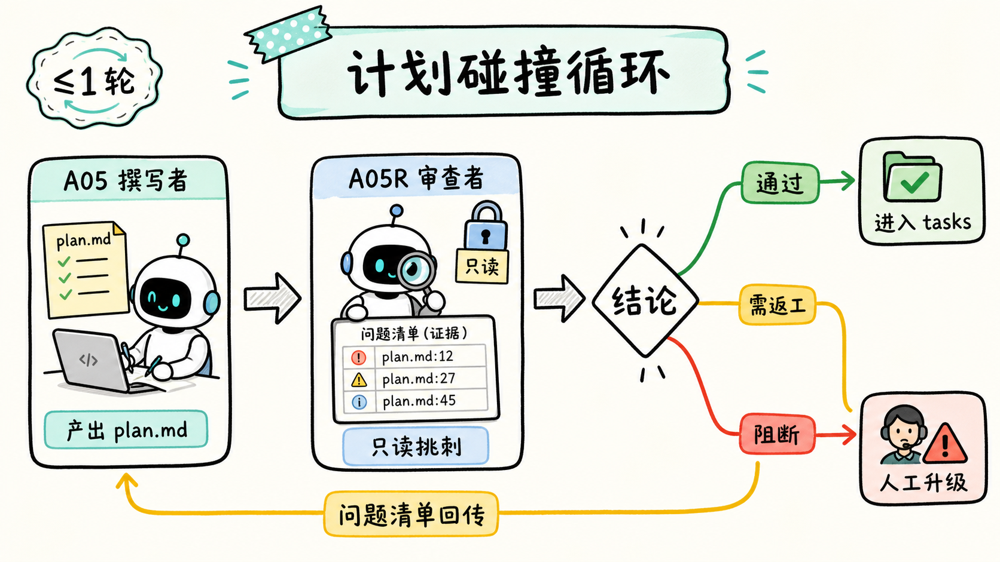
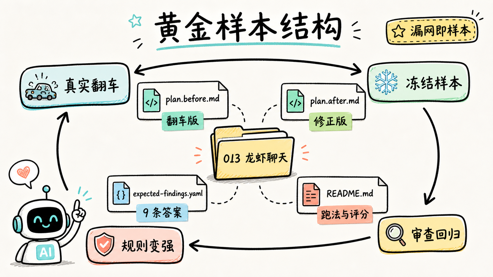
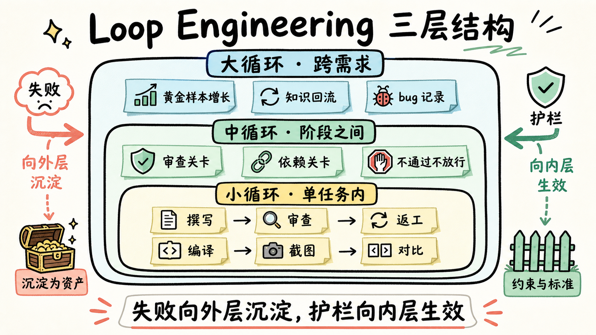
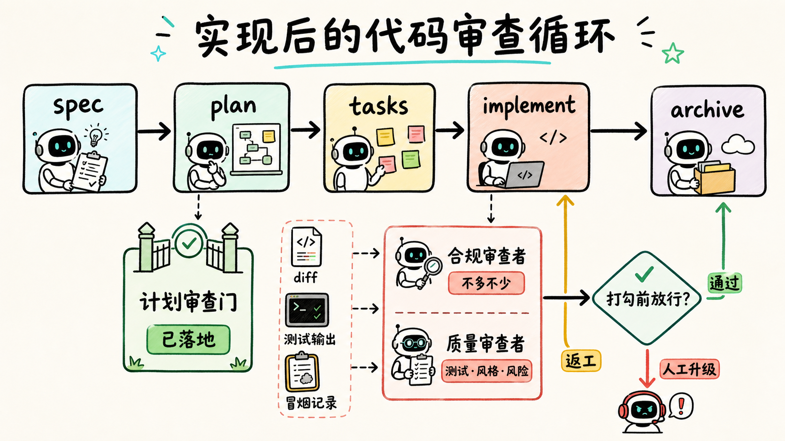

## 先说结论

全文核心就一个公式：**AI 工程质量 ≈ 单次模型能力 × 循环设计**。提示词和上下文只能提高单次生成的命中率，循环负责在出错时把它拉回来。

支撑这个结论的数据：

| 维度 | 数据 |
|---|---|
| AI 自评 vs 实际 | 自评 100 分的实现方案，修改范围低估 3 倍：自称 4 文件 2 Pod，实际 12-14 文件 3 Pod |
| 审查者的考核标准 | 该方案的错误被人工标注成 9 条标准答案；AI 审查者命中 ≥6 条且判「需返工」才算合格 |
| 审查者的实际效果 | 对人工修正后的方案真实运行一次，仍抓出 2 条人也漏掉的验收缺口 |
| 已落地的循环 | 三个月自发长出 5 个，可归为小 / 中 / 大 3 层 |
| 成本上限 | 计划审查封顶 1 轮返工，视觉闭环封顶 3 轮，每个循环都有轮次上限 |
| 起步成本 | 第一个循环（只读审查者 + 返工封顶）约 1 周可落地 |

这些数据背后的三条结论：

1. **单次生成的 AI 有一类错误它自己看不见**——文件存在 ≠ 行为正确，上下文喂再足也治不了，只能靠外部反馈回路。
2. **循环要装在风险最高的翻译点**——五段流程只审「需求 → 代码方案」这一段，轮次封顶、小需求可跳过。
3. **漏网即样本**——每个逃过审查的缺陷都变成回归考题，循环随真实失败自我进化。

下面回到这份自评满分的方案本身。

---

## 一、从一份自评满分的实现方案说起

这份方案出自一个 iOS 单端需求：需求编号 013「龙虾聊天升级」，下文简称 013。

当时 BFS 的流程已经有了基本保障：需求规格（spec）有了，知识提取（knowledge）有了，负责写实现方案的子代理（内部编号 A05，下文叫**撰写者**）也做过子仓约束预检。先看撰写者交出的 `plan.md`，文件头的自我评价一栏全是绿灯：

```yaml
status: final
quality_gate: pass
completion_rate: 100
matrix_coverage: 95
blocking_gaps_count: 0
```

正文里每一条修改点后面都标着「✅ 代码搜索确认路径」。工作量评估写着：**M 级，4 个文件修改 + 1 个新建组件，涉及 2 个 Pod**。

看起来很完整，当时它也确实通过了所有机械检查。但人工 code review 介入后，方案的多处关键结论被逐条推翻。挑几个有代表性的：

**范围低估 3 倍，且前后不一致。** 概览说 4 文件 2 Pod，正文「涉及 Pod」一节列了 3 个，修改文件清单（Context Map）里列了 10 个现有文件——同一份文档三处口径互相矛盾。修正后的真实工作量是 **12-14 个文件、3 个 Pod**。

**幽灵字段。** 方案里写「长按时判断 `conversation.isAI`」。去读真实源码：那个长按回调的入参只有 `cellModel`，作用域里**根本拿不到 conversation 对象**。正确的取法是 `chatDataModel.userInfo.isAI`。这个字段是 AI 推断出来写成事实的——更糟的是，它最早写进了 spec，plan 只是忠实地继承了上游的错。

**「本次不改动」的组件，恰恰必须改。** 方案宣称输入框组件 Composer 不用动。打开源码：`NTESNBChatComposerView.m:1742`，是 Composer **创建并持有**了那个要改的功能面板，delegate 也设给了自己。新状态要下传、按钮回调要上抛，每一跳都必须穿过 Composer——「不改动」物理上不成立。

**乐观的全局方案。** 多选态让气泡右移，方案给的是「对 contentView 做 36pt 全局平移，子类零改动，低风险」。三个问题：视觉稿量出来是 20pt 不是 36pt；「全局」平移会把自己发的消息推出屏幕右边；语音消息的红点挂在 cell 自身而非 contentView 上（`NTESNBChatAudioCollectionCell.m:46`），平移根本带不动它。

**写死的布局假设。** 导航栏右侧留白是按「只有 1 个图标」写死的（源码注释原话「右侧1个icon」），新增电话按钮变成 2 个图标，标题宽度必须重算——方案对此一字未提。

**状态存错了地方。** 多选的选中态被设计成挂在 cellModel 上。但列表的基类 presenter 在一个**远端 Pod** 里，数据数组是私有的，每次刷新都会重建 cellModel——选中态会在刷新后丢失。

注意这些错误的共性：**类名都搜得到，文件路径都存在，但行为全是错的**。谁创建谁、谁代理谁、子视图挂在哪一层、字段在哪个作用域能拿到——这些「行为事实」不打开源码逐行读，是抓不到的。撰写者每行标的「✅ 代码搜索确认」，确认的只是**存在性**，不是**行为**。

如果这份方案直接进入拆任务、写代码，这些错误会全部顺流而下，变成实现阶段一个个难以溯源的 bug。013 这次靠人工 review 兜住了——但人不可能每次都在。

---

## 二、给计划装上第一个循环：碰撞机制

于是我们做了一件事：在撰写者后面，加一个**审查者**（编号 A05R）。流程变成：

```
撰写者产出 plan.md（标记为待审）
        ↓
审查者只读审查 → 产出结构化问题清单（plan-review.md）
        ↓
  通过   → 方案定稿，放行进入拆任务
  需返工 → 问题清单回传撰写者修订，复审一次
  阻断   → 卡住，不许进入下一阶段
```



这套结构的核心是「**碰撞**」：两个角色立场天然对立——撰写者的动机是「交付完整方案」，审查者的动机是「找到不成立的证据」，方案必须在对立审视下存活才能放行。下文称之为**碰撞机制**。几个关键设计决策：

**审查者只挑刺，不动手。** 它没有任何写权限，发现问题只能输出问题清单，修改必须回到撰写者手里。这避免了两个 AI 互相改对方产物的混乱，也保证 `plan.md` 永远只有一个作者。落地时在权限上踩了个值得记下的坑，直接看审查者子代理定义里的工具配置：

```yaml
# .codemaker/agents/bfs-platform-plan-reviewer.md（节选）

# ❌ 最初的写法：试图用禁令实现只读
tools:
  edit: false     # 运行时不支持 false 写法，工具配置直接失效
  write: false    # write 甚至不是合法权限名 → 0 次工具调用，跑空失败

# ✅ 实际可用的写法：白名单只列读类工具
tools:
  read: true      # 读文件
  glob: true      # 列目录
  grep: true      # 搜代码
                  # 注意没有 bash——否则一句 echo > file 就能旁路写盘
```

实测教训：「只读」要靠**能力裁剪**实现——不给的工具它就是用不了；指望一句「禁止写入」的禁令，要么配置失效，要么留着旁路。

**问题清单是结构化的，不是一段评语。** 每条问题必须带：严重等级、方案原文证据、**源码 file:line 证据**、错在哪、要求撰写者改什么。证据强制是这套机制的灵魂——审查者不许说「我觉得不对」，必须说「源码第几行证明不对」。

**行为验证是核心审查项。** 针对 013 的根因，审查规则里专门写了一条：凡涉及调用链、创建归属（谁 new 谁、谁是谁的 delegate）、动态增删子视图、共享组件、远端 Pod 的修改点，审查者必须**真的打开源码读**，只确认了路径存在却声称「已确认」的，一律打回。配套一条置信门控：审查者自己读不到源码、没把握时，**不允许给通过**——「读不到就放过」是被明令禁止的。

**轮次封顶。** 最多一轮返工加一次复审。两轮还过不了就升级人工，避免两个角色无限往复。

**根因回流上游。** 像 `conversation.isAI` 这种错，根子在 spec 不在 plan。审查者会把这类问题单独标记为「上游缺口」，走知识回流去修 spec 和 knowledge——只补 plan 这一处症状，下个需求还会从带病的上游再生产一遍同样的错。

### 前后对比：同一个需求，两份方案

这套机制有没有用，最直接的检验对象就是 013 自身。我们把翻车的 v1 方案和修正后的版本一起冻结成了评测样本，逐项对比：

| 审查维度 | 修正前（自评 100 分） | 修正后 |
|---|---|---|
| 工作量口径 | M：4 文件 / 2 Pod，与正文 3 Pod、清单 10 文件三处矛盾 | M+：12-14 文件 / 3 Pod，三处口径一致 |
| 新增组件 | 声称新建 1 个公开组件 | 0 个，全部收敛为既有类的私有扩展 |
| AI 判断字段 | `conversation.isAI`（该作用域取不到的幽灵字段） | `chatDataModel.userInfo.isAI`（源码可证） |
| Composer 输入框 | 「本次不改动」 | 补全 VC→Composer→面板链路的状态下传与回调上抛任务 |
| 气泡平移 | 36pt 全局平移、子类零改动、低风险 | 约 20pt、仅对方消息平移、自己的消息不动、按消息类型逐一冒烟 |
| 选中态归属 | 挂在 cellModel 上（刷新即丢） | VC 维护以消息 id 为键的稳定选中集合，cellModel 仅做回显 |
| 导航栏 | 未提图标数变化 | 重算双图标留白，电话按钮归入右侧按钮组 |
| 共享面板第三槽位 | 未提游戏入口动态按钮 | 补三方互斥约束，明确不破坏群聊路径 |
| 远端 Pod | 误判为不可改 | 给出「本地化远端 Pod + 功能分支 + owner 协同」的完整落地路径 |

左边那一列，是没有循环时单次生成的产出；右边那一列，才是能开工的方案。**两者的差距不在模型能力，而在有没有一个机制要求它逐条面对源码里的事实。**

### 审查者自己怎么考核：黄金样本

机制装上了，还需要回答一个问题：怎么验证审查者本身是有效的？我们把 013 做成了**黄金样本**——一套带标准答案的回归考题，整个样本就四个文件：

```
BFSTest/plan-review-eval/013-lobster-chat/
├── plan.before.md          # 翻车的 v1 方案——审查者的被测输入
├── plan.after.md           # 人工修正后的版本——「好方案长什么样」的参照
├── expected-findings.yaml  # 答案键：9 条核心问题（即上文对比表），每条带人工核对过的 file:line 证据
└── README.md               # 跑法与评分规则
```



考核分两个方向：

- **检出测试**：拿翻车的 v1 喂给审查者，要求命中 9 条中至少 6 条，且结论必须是「需返工」或「阻断」；
- **误报测试**：拿修正后的版本喂给它，要求给「通过」——不能对合格方案产生误报，误报率高的审查和漏报的审查同样不可用。

两个方向都过，才算审查者在这个样本上成立。2026 年 6 月用真实 CLI 环境跑通：审查者读 spec、读方案、读真实源码做行为验证，正确判出「需返工」，新需求的拆任务阶段也确实被这道关卡拦住过。

最让我意外的是 6 月 9 日对 013 **现行方案**的一次真实运行——注意，这份方案已经是人工 review 修正过的版本，理论上该挑的刺都挑完了。审查者（这次用的是 gpt-5.5）照样给出「需返工」，抓出两条**人和 AI 都漏掉**的验收缺口：

- spec 明确要求长按进入多选前要有**震动反馈**（medium haptic），方案的任务清单里没有这一项——审查者不仅指出了 spec 第几行有此要求，还附上了反证：全仓搜索证明当前代码里根本不存在任何震动反馈实现；
- spec 非功能性需求里列的**无障碍标签**（电话按钮、复选框、分享按钮的 accessibilityLabel），方案和源码双双缺失，每一处都给了 file:line。

第一条对应的原始产物如下（`plan-review.md` 真实节选，仅省略长路径）：

```yaml
status: needs_revision
reviewer_model: "gpt-5.5-2026-04-24"
findings:
  - id: PR-001
    severity: important
    title: "长按进入多选缺少 Haptic Feedback 修正任务"
    evidence:
      - "spec.md:115 要求长按 ≥500ms 后 Haptic Feedback（medium）→ 进入多选模式"
      - "interaction-spec.md:75-77 要求 UIImpactFeedbackGenerator medium impact"
      - "NTESNBPrivateChatCellActionHandleV2.m:345-350 当前只打开菜单"
      - "workspace grep: 未发现 UIImpactFeedbackGenerator/impactOccurred/haptic 实现"
    problem: "plan 修正了长按触发链，但没把 Haptic Feedback 纳入 Context Map 和验证计划"
    required_change: "进入多选前触发 medium impact，并把震动反馈纳入验收覆盖"
resume_focus:
  - "保留当前修正项，新增或扩展任务覆盖 AI 长按 medium haptic。"
```

值得注意它的证据结构：**需求侧两条**（spec 和交互稿各自的行号）、**实现侧两条**（现状代码行号 + 全仓搜索的反证），四条证据闭合成「要求存在、实现不存在」的完整论证——这正是前文「不许说我觉得不对，必须说第几行证明不对」的实际效果。`resume_focus` 则是直接喂回撰写者的修订指令。

这两条都不是「行为读错」型的错误，而是 spec 与 plan 的一致性比对挖出来的遗漏——恰好是人最容易看漏的那类：人盯着「改的地方对不对」，很少回头逐条核对「spec 要的是不是都在」。这类逐条核对恰好是机器的长处。这次运行让我对这套机制的信心从「能拦住 AI 的错」升级到了「能兜住人的漏」。

更重要的是这套考题的**增长规则**：以后每一个逃过审查、到实现阶段才暴露的真实缺陷，都按同样结构新增一个样本目录。审查者的考卷不是一次性出完的，而是随着真实漏网自动变厚——这是后面会讲到的「大循环」。

### 克制：为什么只审这一段

BFS 的开发流程分五段：定义需求（spec）→ 实现方案（plan）→ 拆任务（tasks）→ 实现（implement）→ 归档（archive）。我们**只**给 plan 加了审查，理由很简单：

| 阶段 | 为什么不加 |
|---|---|
| spec | 已有矩阵门禁和提取规则兜底 |
| tasks | 从 plan 机械拆解；plan 对了 tasks 不容易错 |
| implement | 有真实编译、测试、冒烟做天然反馈 |
| archive | 汇总性质，错了影响面小 |

plan 是唯一一段「把自然语言需求翻译成代码修改范围」的纯翻译工作——上游没有代码反例逼它诚实，下游全靠它指路。**风险最高的翻译点，配最严的审查**；其他段加审查，收益配不上成本和延迟。同理，小需求（规模 ≤ S、不碰基类/共享组件/导航/列表/状态型 UI/远端 Pod）允许显式跳过这道关。循环是手段不是信仰。

---

## 三、退后一步：原来我们一直在造循环

碰撞机制跑通之后，我回头盘了一遍 BFS 这三个月攒下的机制，发现一个之前没意识到的事实：**我们其实已经造了 5 个循环，只是从来没给它们起过一个共同的名字。**

| 循环 | 结构 | 封顶 |
|---|---|---|
| 计划碰撞循环 | 撰写 → 只读审查 → 带问题清单返工 → 复审 | 1 轮返工 |
| 视觉闭环 | 编译 → 截图 → 像素 diff → AI 视觉对比 → 改代码 → 重来 | 3 轮 |
| 评测增长循环 | 真实漏网缺陷 → 新黄金样本 → 审查规则回归 | 随失败增长 |
| 知识回流循环 | 实现/审查发现的上游错误 → 回修 spec / knowledge / bugs 记录 | 按需 |
| 运行时重试循环 | 模型过载/限流 → 自动换会话重试 | 次数封顶 |

把它们摆在一起，三层结构就浮现出来了：

```
┌─ 大循环 · 跨需求 ──────────────────────────────────────┐
│   黄金样本增长 · 知识回流修上游 · bug 记录回写           │
│                                                        │
│   ┌─ 中循环 · 阶段之间 ────────────────────────┐       │
│   │   审查关卡：不通过不放行下一阶段              │       │
│   │   依赖关卡：服务端方案过审，客户端才启动      │       │
│   │                                            │       │
│   │   ┌─ 小循环 · 单任务之内 ──────────┐       │       │
│   │   │   撰写 → 审查 → 返工   （≤1 轮）│       │       │
│   │   │   编译 → 截图 → 对比   （≤3 轮）│       │       │
│   │   └────────────────────────────────┘       │       │
│   └────────────────────────────────────────────┘       │
└────────────────────────────────────────────────────────┘
     失败向外层沉淀为资产，护栏向内层生效为约束
```



**小循环（一次任务之内）**：写 → 查 → 改，几分钟到几小时收敛。碰撞机制、视觉闭环的单轮都是小循环。它解决的是「单次生成自己看不见的错」。

**中循环（阶段与阶段之间）**：上一段的产物要过关卡（gate）才能进下一段。审查不通过就进不了拆任务；服务端方案没过审，客户端方案就不许启动。它解决的是「错误顺流而下越滚越大」。

**大循环（跨需求、跨周期）**：这个需求的失败，变成下个需求的护栏。黄金样本、知识回流、bug 记录回写都是大循环。它解决的是「同一个坑反复踩」。

这个名字其实不用自己起——最近业界开始讨论的**循环工程（Loop Engineering）**，说的正是这件事。我们不是照着这个理念去设计的，而是回头对照时发现，三个月的实践恰好命中了它。放进大家熟悉的演进序列里看：

- **提示词工程**（prompt engineering）：管单次输入怎么写；
- **上下文工程**（context engineering）：管单次输入带哪些材料——知识库、代码图谱、约束预检都属于这层；
- **循环工程**（loop engineering）：管**多次执行之间的纠错结构**——谁来发现错、错了流向哪、改几轮、关卡设在哪、失败如何沉淀。

前两层 BFS 做了三个月，收益实实在在，但天花板也很明显：它们都只能提高**单次**生成的命中率，对「模型自己看不见的错」无能为力。013 那份方案，上下文给得不可谓不足——spec、knowledge、子仓约束全喂了——照样翻车。补上第三层之后，质量公式才完整：

> **AI 工程质量 ≈ 单次模型能力 × 循环设计**

模型能力那一项由厂商决定，工程团队无从干预；循环设计这一项，才是团队自己能够做功的地方。

从已落地的循环里，还能提炼出五条通用原则：

1. **审查者只读**。发现问题和修复问题必须是两个角色，且用能力裁剪（而非措辞禁令）保证只读。
2. **轮次封顶**。任何循环都有最大轮数，到顶升级人工，不许无限拉扯。
3. **便宜的检查先行**。能用脚本机械检查的（路径存在性、口径一致性、缺状态矩阵），不要烧模型 token；脚本筛完，AI 审查者只处理需要判断力的部分。
4. **置信门控**。审查者读不到证据时不许给通过——宁可误杀进返工，不许「看不见就放行」。
5. **漏网即样本**。每个穿透循环的真实缺陷，必须变成回归考题，让循环自我进化。

---

## 四、用框架推演下一个循环：实现后的代码审查

框架的价值不在解释过去，在指导未来。顺着三层结构看，下一个最值得装循环的位置很明显：**实现阶段的代码审查**——任务执行者（A07）写完代码之后、打勾之前。

```
定义需求 ──► 实现方案 ──► 拆任务 ──► 实现 ──► 归档
 (spec)      (plan)     (tasks)  (implement) (archive)
               │                     │
          ┌────▼─────────┐     ┌─────▼──────────────┐
          │ 计划审查门    │     │ 代码审查门（规划中） │
          │ 已落地、已验证 │     │ 合规审查 + 质量审查  │
          └──────────────┘     └────────────────────┘
```



构想中是两个审查角色，分两阶段：

- **合规审查者**：只回答一个问题——这次提交是否**不多不少**恰好完成了任务要求？少做了什么、多做了什么（顺手加的功能、顺手的重构、顺手改的注释）。「不多不少」这个维度是计划审查里没有的，针对的是 AI 生成最常见的一类偏差：补充任务要求之外的内容。
- **质量审查者**：合规过了再看质量——测试覆盖、错误处理、与周边代码风格的一致性、安全隐患。

直接照抄碰撞机制是不行的，实现阶段有三个本质不同，恰好是设计的关键题：

**第一，审查者手里有真证据了。** 计划审查时只能靠读源码推演；实现阶段有编译结果、测试输出、冒烟记录。审查者应该优先消费这些**确定性证据**，而不是再读一遍代码自由心证——这其实是「便宜的检查先行」原则的自然延伸。

**第二，审的是 diff 不是文档。** 方案是几百行的自包含文档，代码改动是散落多文件的增量。只看 diff 会漏掉「改了这里、忘了那个对称位置」这类问题；带全量上下文又贵。初步倾向：以 diff 为主，按 diff 触点拉取周边代码做有限扩展。

**第三，触发粒度是成本取舍。** 每个原子任务后都审（拦截早、成本高、打断节奏），还是整个阶段完成后批量审（成本低、返工远）？初步倾向参考计划审查的克制经验：合规审查每任务做（它轻，只比对任务要求和 diff）；质量审查按阶段批量做，且小任务可跳过。

这一段还没落地，放在这里恰好当框架的「预测力」测试：如果循环工程这套思路是对的，这个新循环落地后，应该同样能用「前后对比 + 黄金样本」的方式自证价值。

---

## 五、可迁移的落地路线：从小循环开始

最后这部分写给想在自己团队试这套思路的同学。不需要照搬 BFS 的五段流程，循环工程的落地可以循序渐进，每一步都独立产生收益：

**第一步：装一个小循环（一周内可落地）**

1. 找到你们流程里**风险最高的翻译点**——通常是「自然语言变成技术决策」的那一步：实现方案、技术选型、接口设计。不要贪多，就选一个。
2. 给它配一个**只读审查者**：可以是另一个 AI 会话、另一个模型，甚至同一个模型换一个对立人设。关键是权限上物理只读、动机上只负责找反例。
3. 约定**结构化的问题清单**格式，每条问题强制带证据（源码位置、文档原文）。没有证据的意见不算数。
4. 轮次封顶：一轮返工、一次复审，过不了就升级人工。

只做到这一步，你就已经能拦住「自评满分、实则翻车」这类最贵的错误了。

**第二步：把小循环升级成中循环（一个月）**

5. 把审查从「建议」升级成**关卡**：审查不通过，流程就不许进入下一阶段，而不是「仅供参考」。
6. 在 AI 审查之前加**机械检查脚本**：路径存在性、前后口径一致性这类确定性规则，用脚本拦，省下模型成本去处理真正需要判断力的问题。
7. 审查产物**落盘可追溯**：每次审了什么、结论是什么、谁据此放行，要能事后查。

**第三步：让循环自我进化成大循环（长期）**

8. 你的**第一个黄金样本，就是你的第一次真实翻车**。把翻车版和修正版一起冻结，人工标注问题清单作为答案键。
9. 建立「漏网即样本」的纪律：每个穿透审查、在实现或线上才暴露的缺陷，回头补成回归考题。
10. 根因回流：审查发现的错，如果根子在上游文档/知识库，必须回修上游，不许只补下游症状。

一张速查表收尾：

| 自检问题 | 对应原则 |
|---|---|
| 发现错的和修错的，是同一个角色吗？ | 审查者只读 |
| 循环有最大轮数吗？到顶了流向哪？ | 轮次封顶 |
| 脚本能查的，在烧模型吗？ | 便宜检查先行 |
| 审查者「看不到证据」时，默认放行还是默认拦下？ | 置信门控 |
| 上一次翻车，变成回归考题了吗？ | 漏网即样本 |
| 这个循环装在风险最高的位置吗？还是装着好看？ | 克制 |

---

## 结语

回头看 013 那份方案，最值得深思的是文件头里那行 `quality_gate: pass`——**生成者给自己打的满分**。这三个月所有循环工程实践，本质上都在对抗同一件事：AI 的自评不可信，不是因为它不诚实，而是因为它结构性地看不见自己的盲区。

解法不神秘：让看得见的角色去看，让看的结果有强制力，让漏掉的变成下次的考题。提示词决定了 AI 单次能走多远，上下文决定了它掌握多少事实，而**循环决定了它走错时，有没有人把它拉回来**。

模型还会继续变强，但再强的模型，也需要一个能告诉它错在哪的结构。对 BFS 而言，下一个要搭的结构已经明确：implement 阶段的代码审查循环。


---

> 相关材料：碰撞机制设计全文见 `BFSDesign/bfs-plan-review-gate.md`；审查规则清单见 `.agents/skills/bfs.plan/references/common/plan-review-rules.md`；013 黄金样本（翻车版/修正版/答案键）见 `BeeFullStack_Public/BFSTest/plan-review-eval/013-lobster-chat/`；增强子代理（含代码审查者）规划见 `BFSDesign/bfs-superpowers-agent-expansion.md`。
