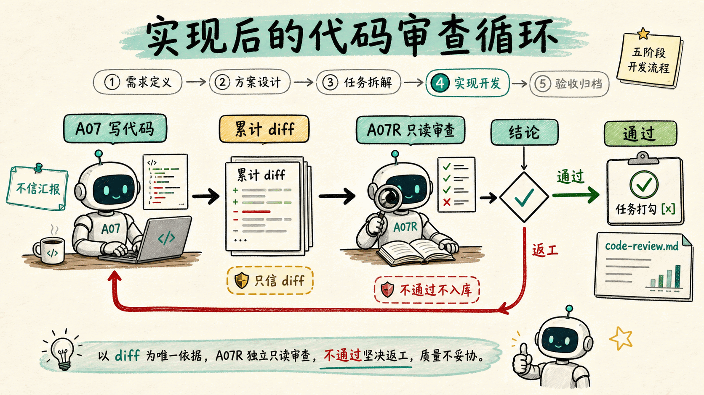
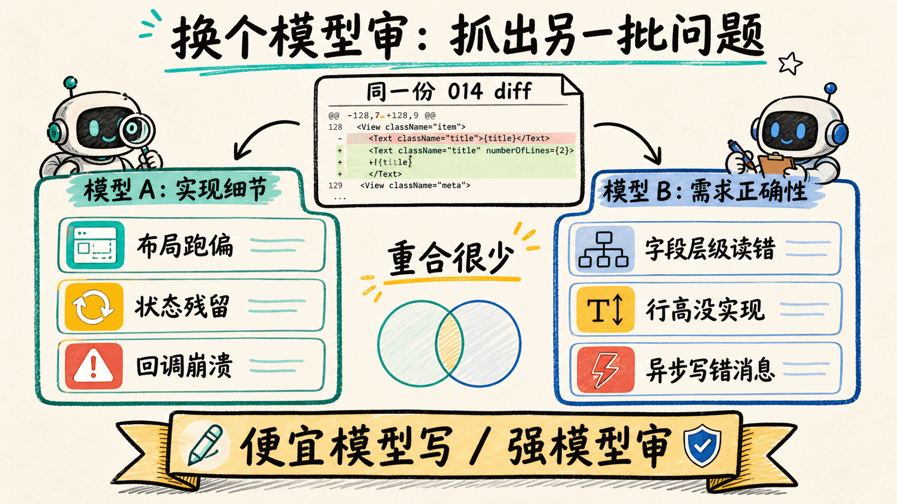
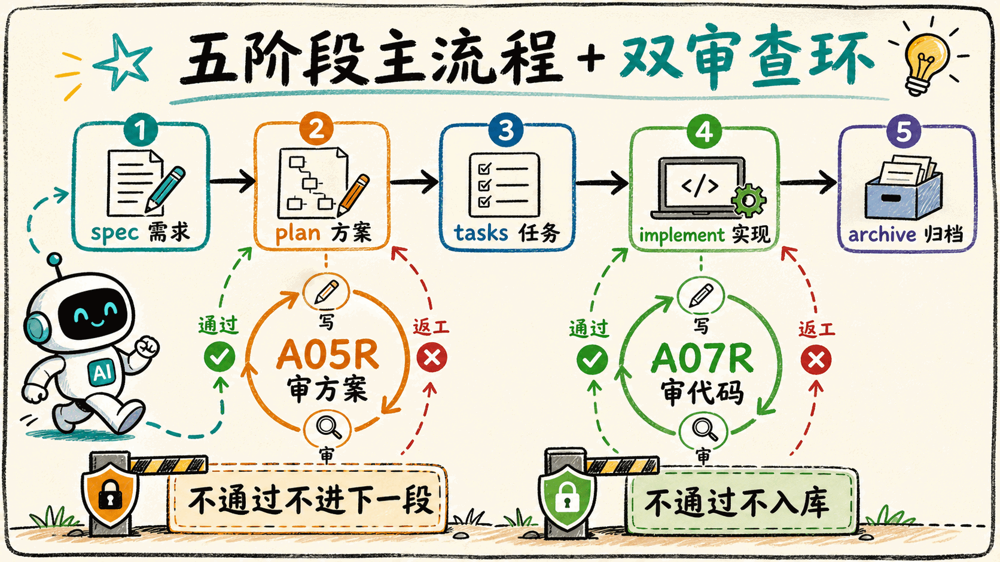

## 先说结论

上一篇的公式这里继续成立：**AI 工程质量 ≈ 单次模型能力 × 循环设计**。计划阶段的审查循环管「需求 → 修改范围」翻译对不对；这一篇补上的代码审查循环，管「任务 → 真实代码」做得对不对、全不全、有没有多做。

支撑这篇的数据，全部来自对 014 实现代码的真实审查：

| 维度 | 数据 |
|---|---|
| 样本 | iOS 单端需求 014「语音转文字」，代码已实现、可编译、执行者自评完成 |
| 审查结论 | `needs_revision`——抓出 20 多条问题（含多条阻断级），**无一是编译错** |
| 最典型一条 | 接口结果从 `dataInfo` 直接取 `text`，而需求要的是 `data.text` 嵌套字段——代码不报错，只是永远取不到结果 |
| 跨模型发现 | 两个不同模型审同一份代码，抓出的问题**几乎不重叠**——一轮盯布局/状态，一轮盯需求细节/正确性 |
| 成本取舍 | 强模型只放在审查节点（每个需求跑 1～2 次），写作/执行仍走便宜模型 |
| 落地形态 | 计划门（上篇）+ 代码门（本篇）= 双环；客户端一键切换审查模型 |

三条结论：

1. **AI 代码的风险不在「跑不起来」，在「跑得起来但做错、做漏、做多」**——这类错编译器和单测都拦不住，只能靠拿着需求逐条对照源码去审。
2. **审查者和被审者最好是不同的模型**——同一个模型审自己同源的产出，共享同一批盲区；换个模型，抓出来的是另一批问题。
3. **「审查」这道工序很便宜**——它低频、高杠杆，把贵模型放在这里最划算。

---

## 一、承接上一篇：循环要装在「翻译点」

上一篇（《从 Prompt Engineering 到 Loop Engineering》）讲了第一道门：在「实现方案（plan）」产出后、进入拆任务前，加一个只读审查者，专挑方案里「类名搜得到、但行为全错」的翻译错误。它命中的是业界正在讨论的**循环工程（Loop Engineering）**——管的不是单次输入怎么写（提示词工程）、带哪些材料（上下文工程），而是**多次执行之间的纠错结构**：谁来发现错、错了流向哪、改几轮、关卡设在哪。

那篇结尾留了一个预测：顺着这套思路，下一个最该装循环的位置是**实现阶段的代码审查**——执行者写完代码、打勾之前。这篇就是去把这个预测兑现，并回头看它是否成立。

> 顺带交代一下编号：上一篇的主角是需求 013「龙虾聊天升级」（在 AI 私聊页加长按多选生成分享图、打电话入口）。它是个大需求，即使过了计划门，实现阶段仍冒出 6 个 bug——这恰恰说明计划门拦不住实现期的错，需要第二道门。013 的细节这篇不展开，本文换一个更干净的单端样本 014 来讲。

---

## 二、第二道门：实现完成后的代码审查

新增的审查角色内部编号 **A07R**，挂在执行者（A07，负责按任务清单写代码）后面。流程是：

```
执行者写完本轮所有待办任务的代码
            ↓
代码审查者只读审查累计 diff → 产出结构化结论（code-review.md）
            ↓
   通过   → 任务才允许打勾 [x]，进入收尾/归档
   需返工 → 保留问题清单，开发者据此修复后重跑
```



几个关键设计，和计划门一脉相承，但针对「审代码」做了调整：

**一次过，两个视角，按顺序来。**
- **合规（compliance）**：这次提交是不是**不多不少**恰好完成了任务要求？少做了什么、做错了什么、有没有任务之外顺手加的东西。「不多不少」是计划门没有的维度，专治 AI 最常见的一类偏差——补充任务没要求的内容。
- **质量（quality）**：合规过了再看质量——单一职责、命名、重复、空值/边界/并发/错误处理、安全、与周边代码风格一致、端上的 UI 规范。

**只信 diff，不信汇报。** 审查者拿不到执行者的"我做完了"自评，只拿到任务原文 + 真实 diff/源码，逐行比对。执行者声称做了、代码里找不到的，按「漏做」计。

**审的是 diff，而且是整段的累计 diff。** 代码改动散落在多个文件里，只看单个任务的 diff 会漏掉「改了这里、忘了对称的那里」和「跨任务偷偷扩大范围」这类问题。所以代码门默认审的是**本轮所有任务的累计改动**，而不是逐个任务孤立地看。

**只读靠能力裁剪，不靠措辞禁令。** 审查者只给读类工具（读文件、列目录、搜代码、只读 git diff），不给写、不给改任务清单——发现问题只能产出问题清单，修复必须回到执行者手里。这保证了「发现错的」和「修复错的」永远是两个角色。

---

## 三、014 实战：代码审查抓出了什么

014「语音转文字」是个看起来不大的需求：在语音消息上长按「转文字」，调接口识别，把结果显示在气泡下方。代码写完、能编译、跑得起来。然后我们对它做代码审查，结论是 `needs_revision`。挑几条有代表性的，按「错在哪一类」分组——注意它们的共性：**全都能编译、看着都像做完了**。

**做错了细节（看着完成，其实和需求不符）**
- 接口回来后，代码直接从 `dataInfo` 里取 `text`，而需求约定结果在 `data.text` 的**嵌套层级**里。字段路径读错了——代码不报错，只是永远取不到正确结果。
- 结果文字直接 `setText`，没按需求用富文本实现 24px 行高。多行转写结果的行距和设计稿对不上。

**做漏了边界（任务覆盖到的场景，代码里没处理）**
- 撤回一条已经显示了转写结果的语音消息后，旧的转文字框没被清理，cell 上会残留。撤回这条边界路径被漏掉了。
- 接口「成功」但返回的 text 为空时，代码当成功展示，用户看到一个空白灰框——空结果没归到失败态。

**藏着隐患（能编译、能跑，但偶发出错）**
- 异步识别回调里用 `self.cellModel` 写状态。但回调还没回来时，用户若长按了别的消息，`self.cellModel` 已经被复用、指向另一条消息——结果可能**写到错误的消息**上。编译没问题，偶发串台。
- 同一个回调里，强引用化之后没做空判断；用户中途离开聊天页、对象已释放时，往数组里塞 `nil` 可能直接崩溃。

这些问题，没有一个是「语法错」或「编译不过」。它们是 AI 写代码最典型的一类产出：**结构对、能跑、看着完成，但对照需求逐条核，处处是缺口**。靠人去逐条核对每一行 diff 对不对、全不全，既累又容易走神；这恰恰是机器的长处。

---

## 四、一个意外发现：换个模型审，抓出的是另一批问题

最值得记下来的不是上面这些条目本身，而是这件事：**我们用两个不同的模型，先后审了同一份 014 代码，两轮抓出的问题几乎不重叠。**

- 一轮（较便宜的模型）盯住的是**布局、状态机、崩溃**：自己发的语音转文字框按左侧布局会跑出屏幕、loading 父视图没有稳定宽高、撤回态残留、回调缺 nil 保护可能崩……
- 另一轮（换成更强的 gpt-5.5）抓出的几乎是另一批，重心在**需求细节与取数正确性**：接口字段读错层级、结果文字没按 24px 行高实现、异步回调可能写错消息。

两轮叠起来二十多条，重合的极少——一个盯实现细节，一个盯需求符合度，各看各的。



这说明一个朴素但容易忽略的事实：**审查者和被审者如果是同一个模型，会共享同一批盲区**——它写代码时没想到的，审代码时大概率也想不到。上一篇计划门之所以有效，部分原因正是当时用了和撰写者不同的模型去审。代码门也一样：**让审查节点用一个和写代码不同的（且更强的）模型，是这道门发挥价值的关键变量**，而不是可有可无的调参。

于是问题落到工程上：怎么让用户能**一键切换审查模型**，又不给仓库添乱。这是下一节的主题。

---

## 五、落地：在客户端动态切换审查模型

要让「换个模型审」从一句道理变成日常能用的功能，得让人选起来简单、切起来不脏仓库。BFSMacClient 把这件事收进了设置里的一个开关。

### 5.1 设置里长什么样

设置 →「BFS Workflow Runtime」→「审查模型」，是一组 chip 单选：DeepSeek V4 Pro（默认）、V4 Flash、Kimi、GPT-5.5、Claude Opus / Sonnet / Haiku 等七个常用模型；选中非 deepseek 时，卡片会标一个「强模型」徽章提醒成本。选一次，计划门（A05R）和代码门（A07R）共用这个模型。

### 5.2 两条路径都认这个设置

同一个设置，要在两条完全不同的派发路径下都生效：

- **Workflow 路径**（结构化跑 `/bfs.plan`、`/bfs.implement`）：客户端编排工作流时，把所选模型直接写进两个审查节点的 `model`；同时让预算闸门（budget governor）**只对这两个 reviewer 节点放行强模型**，写作 / 执行节点仍锁死 deepseek。所以「强模型只烧在审查节点」在这条路径里是被强约束保证的，不靠自觉。
- **自然语言路径**（直接在对话里说「审一下这段代码」）：子代理用哪个模型，取自 CodeMaker 的 agent 配置，而不是对话里的主模型。客户端在这里维护一层「用户级模型覆盖」，让自然语言触发的审查也用上所选模型——而不是让客户端去猜你那句话想干嘛。

这套「贵模型只放审查节点」的取舍，014 验证过一次：那轮强模型多花的开销，和它独家抓出的需求细节问题相比，完全值得。

### 5.3 踩的坑：怎么覆盖才生效，又不脏 git

CodeMaker 按层加载子代理配置：工程里的 `.codemaker/agents/<名字>.md` 是 canonical 定义，用户级的 `~/.codemaker/codemaker.json` 最后加载、优先级最高。实测踩到的坑是：**在工程配置里只补一行 `agent.<名字>.model`，覆盖不了同名 `.md` 里的模型**——必须在用户级配置里写入**完整的 agent 对象**（`name` / `description` / `mode` / `tools` / `model` / `prompt` 全量）才真正生效。

所以客户端切审查模型时，是这么一套动作：

1. 读当前 workspace 里那个 canonical 的 `.codemaker/agents/<名字>.md`，解析出 frontmatter 和正文 prompt；
2. 原样复制成一个 config agent 对象，**只把 `model` 一项替换**成所选模型；
3. 合并写进用户级 `~/.codemaker/codemaker.json` 的 `agent.<名字>`，保留里面原有的 `mcp` / `plugin` 等字段；
4. 优先读当前执行 workspace 的 agent 文件，读不到再回落 BFS 大脑仓，避免把旧 prompt 同步成全局覆盖。

写出来的用户级配置大致长这样（`prompt` 会全量写入，这里省略）：

```jsonc
// ~/.codemaker/codemaker.json —— 用户级、不进 git
{
  "agent": {
    "bfs-code-reviewer": {
      "name": "bfs-code-reviewer",
      "mode": "subagent",
      "model": "netease-codemaker/gpt-5.5-2026-04-24",   // ← 只有这一项是切出来的
      "tools": { "bash": true, "read": true, "glob": true, "grep": true },
      "prompt": "…（从项目 .md 原样复制）"
    }
  }
}
```

这样换来的是：工程里被 git 跟踪的 `.md` 一个字不动（默认仍是成本友好的 deepseek，别人 clone、新需求跑起来都不受影响），模型偏好只留在本地、`git status` 始终干净；选回 deepseek 时写一条 deepseek 覆盖即可，行为稳定。切完想确认有没有生效，一条命令就够：

```bash
codemaker debug agent bfs-code-reviewer | jq '{name, model}'
```

两个要留意的边界：用户级覆盖是**全局**的（影响所有项目），所以 BFS 自定义工作流用 `bfs-code-reviewer` 这类项目专属名字，避免和通用 agent 撞名；另外若 daemon 不热加载用户级配置，切换后重启一下客户端才生效。

---

## 六、完整的双环工作流：为什么这么设计，以及好处

两道门都装好之后，BFS 自定义工作流的开发流程现在长这样——五段主流程不变，但在风险最高的两个「翻译点」各嵌了一个审查循环：



```
   定义需求 ───► 实现方案 ───► 拆任务 ───► 实现 ───────► 归档
    (spec)       (plan)      (tasks)   (implement)    (archive)
                   │                       │
        ┌──────────▼───────────┐ ┌─────────▼────────────┐
        │  计划审查门 · A05R     │ │  代码审查门 · A07R      │
        │  〈上一篇〉            │ │  〈本篇〉              │
        ├──────────────────────┤ ├──────────────────────┤
        │ 撰写者 A05 产出方案     │ │ 执行者 A07 写完代码     │
        │        ↓ 碰撞          │ │        ↓ 碰撞          │
        │ 审查者只读挑刺          │ │ 审查者只读挑刺          │
        │   ├ 通过 → 进拆任务    │ │   ├ 通过 → 勾完成/归档 │
        │   └ 返工 → 回 A05 改   │ │   └ 返工 → 回 A07 改   │
        │ 审：改范围 / 代码事实   │ │ 审：不多不少 + 代码质量 │
        │ 依据：plan 文档        │ │ 依据：真实 diff，不信汇报│
        └──────────────────────┘ └──────────────────────┘
              deepseek 写  /  （可选）强模型审  ← 设置里一键切
              不通过不进下一段        不通过不入库
```

### 6.1 为什么是这两个位置，而不是每一段都装

五段里，只有 plan 和 implement 是「把自然语言翻译成不可逆产出」的**纯翻译点**：plan 把需求翻译成「改哪些文件、动哪些范围」，implement 把任务翻译成「真实的代码改动」。这两段一旦翻错，错误会顺流而下，越滚越大、越来越难溯源。

其余三段不需要专门的审查门：spec 有矩阵门禁和提取规则兜底；tasks 是从 plan 机械拆解，plan 对了 tasks 不容易错；archive 是汇总性质，错了影响面小。**风险最高的两个翻译点，各配一道最严的审查；其他段加审查，收益配不上成本和延迟。** 同理，足够小、不碰基类/共享组件/状态型 UI 的需求，允许显式跳过审查门——循环是手段，不是信仰。

### 6.2 为什么审查者必须只读、且和撰写者对立

每个门里都是一对立场天然对立的角色：撰写/执行者的动机是「交付完整」，审查者的动机是「找到不成立的证据」。产物必须在对立审视下存活，才能放行。而且审查者是**物理只读**的（靠能力裁剪，不靠"禁止写入"这种措辞）——发现问题只能产出清单，修复必须回到撰写/执行者手里。这样保证了：发现错的和修复错的，永远是两个角色；每份产物永远只有一个作者。

### 6.3 为什么两个门都给「换模型」留了口子

第四节那个发现就是答案：同模型审同源产出会共享盲区。所以两个门都支持把审查节点切到一个**与撰写/执行不同的模型**。这不是花哨功能，是审查能不能抓出"写的人想不到"那类错的关键——具体怎么在客户端一键切、又不脏仓库，见第五节。

### 6.4 这套设计带来的好处

- **把最贵的错挡在入库前。** 「自评满分、实则翻车」是 AI 交付里最贵的一类错——它会一路顺流到线上。014 这一道代码门，在打勾入库前拦下了 20 多条问题，其中多条是阻断级。
- **成本可控。** 贵模型只在低频的审查节点烧，写作/执行的高频 token 仍走便宜模型，一个需求的总成本只涨一点。
- **跨模型审查从理论变成日常。** 设置里一键切换，两条路径都生效，开发者不需要懂底层配置就能用上「deepseek 写 / 强模型审」。
- **仍有漏网，但比例很低。** 014 上线前的实测里还冒出过 1 个 bug——审查门不是万能的。但一个需求只漏 1 个，本身也说明前面两道门兜住了绝大多数。

---

## 结语

上一篇说，AI 的自评不可信，不是因为它不诚实，而是因为它结构性地看不见自己的盲区。计划门是让「看得见的角色」去看方案；代码门是让「看得见的角色」去看代码——而且这次还多了一层：**让看的人，最好是另一个脑子**。

014 这个样本里，代码能编译、能跑、自评完成，逐条审下来却处处是「看着对、其实不对」。这些缺口，编译器拦不住、单测大概率也拦不住，但一道拿着需求逐行对照 diff 的审查门拦住了。模型还会继续变强，但再强的模型写完代码，也需要一个能告诉它"这里和需求对不上"的结构。

至此，BFS 自定义工作流的两个翻译点都装上了审查循环。
