## 「机械」

望着今年WWDC 2026的Session表，我机械地打开Codex，让它给我总结起重要的更新，看着一行一行飞快吐出来的文字，恍然间让我想起了当时适配Vision Pro网易新闻的那段古法时光，一页一页文档查询，一行一行没用过的新知识代码，从立项到和审核斗智斗勇，最后让网易新闻成为第一个适配VP的国内新闻类应用，那种成就感，让人无比怀念……

虽然但是 现在这个时刻，我连认真看一篇地道印度口音的全英 Session的耐心都没有了。

AI Agent 带来的正反馈太快太强烈，但依然没有摆脱让人不安心不保险的感觉。于是我开始思考AI和我的协作占比关系，我不能完全放心的完全双手离开键盘，又不能事事过问，那样只会让我感觉更累。经过过去一段长时间高强度的使用CC Codex Codemaker等，我开始慢慢意识到，大概这是一个长久的持续战，碳基生物的参与感到底到多少是合适的，可能是未来一个比较有意思的话题。

于是我回到了屏幕上机械地看着Codex总结的WWDC26亮点，默默地回了一句，中国开发者需要注意啥，新feature哪些需要注意适配，然鹅就像那个15秒看完今年WWDC的视频那样，实在是找不到啥能立刻让我动工的内容。

日子还得过，要不还是先回顾一下过去三个月高强度拥抱AI的体验吧~

## 「融合」

我更愿意称这个阶段叫做融合。带一点互动性质，我觉得我行，因为我具备了AI不了解的工程领域知识，我觉得我不行，是因为我无法在短短时间内码出那么多代码和文字。于是我重新审视之前的公式：**AI 工程质量 ≈ 单次模型能力 × 工程设计**。似乎我感觉少了点味儿，于是新公式发明出来了:

**AI 工程质量 ≈ 单次模型能力 × 工程设计 × 我**

所以我干了啥呢:

| 维度 | 数据 / 结论 |
|---|---|
| 投入 | 3 个月、450 次提交，覆盖工作流、知识、客户端、上游四条线 |
| 同一个人、同一套 AI 的落差 | 一个需求 AI 很快写完却留下大量返工；另一个需求走完审查再入库，线上反馈明显收敛 |
| 主线 | 从 **Prompt Engineering** → **Harness Engineering** → **Loop Engineering**：把「靠模型自觉」换成「靠工程强制」 |
| 工作流可靠性 | 子代理扇出由代码执行而非模型自觉，「说派 5 个实派 1 个」物理上不再可能 |
| 知识覆盖 | 多端代码图谱和结构化知识库已经接入工作流；具体仓库、模块、节点和参考篇数不在公开稿展开 |
| 客户端 | 4/25 第一个 MVP，7 周迭代成 9+ 能力的桌面工作台 |

---

## 「抱后感」

**第一，交付为王，人机磨合是一场持久战。** AI 终究是工具，落点始终是交付。我并不赞成为了「显得很 AI」就过度削减人的参与——该人来把关的地方硬塞给模型，省下的时间会以线上事故的形式还回来。人和 AI 怎么配合，是一件需要持续磨的事。

**第二，谈提效，下班时反而更累。** 这点挺反直觉。AI 把单点动作变快了，但一个人能同时推进的事情变多了，要操心的面也更宽了。于是真正的功夫不在「让 AI 多干」，而在**厘清边界**：哪些可以放心交给它，哪些必须由人来判断和兜底。想清楚这条线，比加一个功能更省心。

**第三，易用和可靠，不见得是一对矛盾。** 这三个月我越来越确信，分层、契约、验证、回归这些「古法」软件工程思想，在 AI 时代不但没过时，反而是约束 AI 的最好抓手。把它们包在模型外面，易用和可靠可以同时拿到。

**第四，大需求交付结果不理想，拆得越小越niubility。** 做过了几个需求，我其实发现需求拆得小，不仅实现得快，产物短小可读，连交付质量都有了一定的保障。所以我现在更喜欢把大需求拆小来做。

这四句话，催生了后面要讲的整套工作流。它的主线，可以用一张图概括：

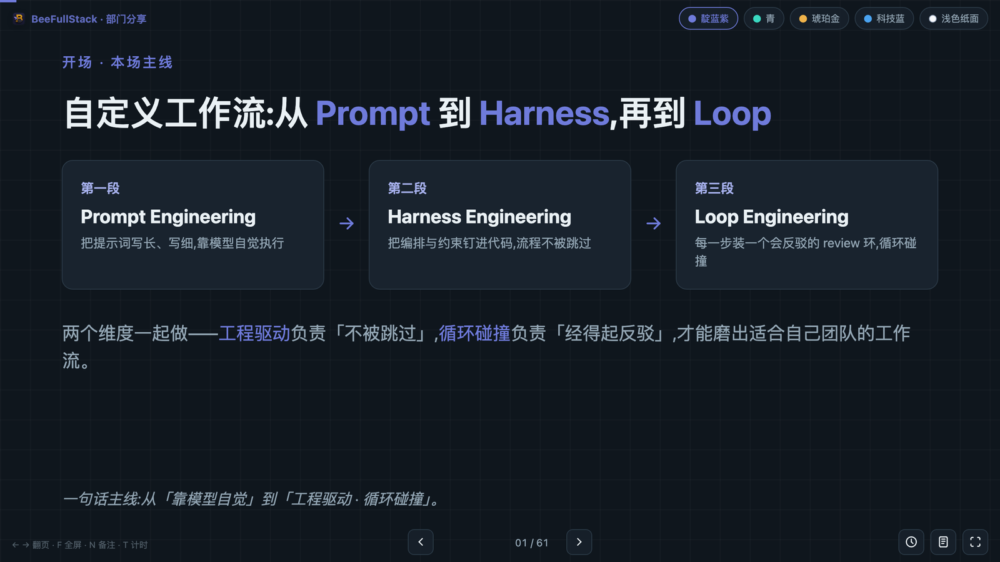

- **Prompt Engineering**：把提示词写长、写细，靠模型自觉执行。这是大多数人的起点，也是上限最低的一段。
- **Harness Engineering**：把「谁先谁后、谁等谁、什么时候算完成」这些编排纪律从提示词里搬进代码，由程序强制执行，流程不被跳过。
- **Loop Engineering**：在关键步骤上各装一个「会反驳的环」——计划写完先被审一遍、代码写完再被审一遍，碰撞过才放行。

工程驱动负责「不被跳过」，循环碰撞负责「经得起反驳」。两个维度一起做，才能磨出一套适合自己团队的 AI 工作流。

---

## 「惊喜」

先看一组对比。两个需求，同一个人、同一套 AI 工具，结果天差地别。

4 月，一个需求 AI 几乎一天就写完了。看起来效率惊人，但每个模块都有遗漏，最后留下了大量线上返工，人工又花了一段时间才补完。6 月，另一个需求走了完整的审查流程再入库，上线后的反馈明显收敛。

当然了，我肯定挑效果最好的需求拎出来说。节目效果好吧。

模型没换、人没换——中间发生的，就是这篇文章要讲的四件事。我把这三个月拆成四块，它们也正好是 4、5、6 三个月的真实演进顺序：

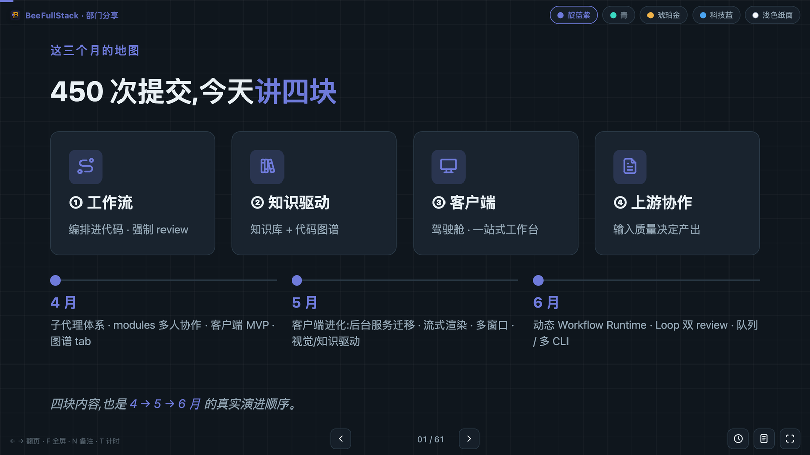

---

## 模块一 · 工作流：从「提示词硬扛」到「编排活在代码里」

### 五段范式：AI时代加速了「借鉴」的速度

BFS 把每个需求拆成五段推进，借鉴了传统 Spec-Driven Development 的严谨，但为我们的全栈工程做了量身定制，当然骨架借鉴的就是SpecKit和OpenSpec，加上一些 SuperPowers的灵感和思路：

- **spec — 做什么**：需求边界、验收标准、知识提取，所有后续都锚定在这里。
- **plan — 怎么做**：模块影响面、技术方案、约束条件，必须先通过计划审查。
- **tasks — 拆成原子任务**：每个任务文件不重叠、可独立验证，支持并行和「先测后写」。
- **implement — 子仓实现并验证**：在真实子仓库编码 + 编译验证 + 代码审查，产物可追溯到具体任务。
- **archive — 归档与知识回流**：验收总结、bug 记录、知识沉淀，确保经验不丢。

大需求还有一种「多人协作」模式：按页面切片，每人负责自己的一块、物理隔离，状态用一份元数据文件作为唯一事实源，进度三级聚合。

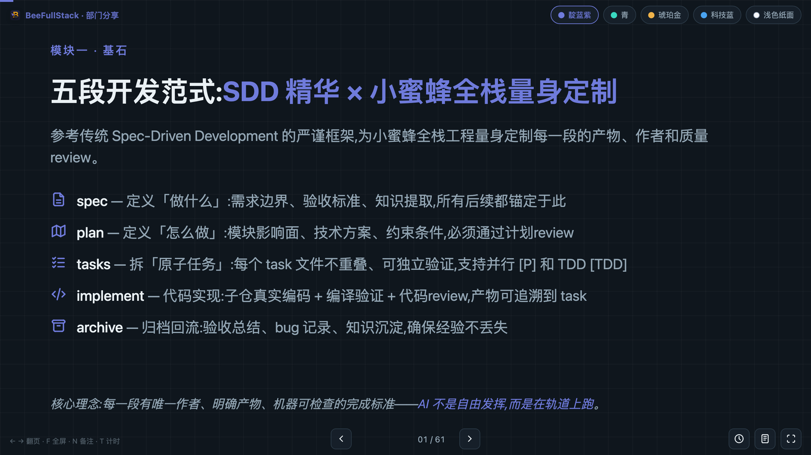

关键不在「分五段」本身，而在于每一段都有**唯一作者、明确产物、机器可检查的完成标准**。用白纸黑字的规则约束 AI，似乎是目前最靠谱的纠偏方式。

五段是统一的骨架，但不能把所有端当成同一种工程。各端差异巨大，工作流，工作方式，不太可能一种范式套用，但是又不能不丢掉需求开始到归档回流这个闭环，因此我只定义骨架，只定义我希望AI全流程的大致流转，而具体细节我拆分到各端的`runbook`中。并把这个各端差异交给各端真正懂球的同事手里维护，远比我一人蛮干强得多。

同一条五段流水线，每个端的「跑法」完全不同：依赖管理、工程入口、验证命令、发布边界和回归重点都不一样。这些差异如果都塞进一个上千行的大提示词，模型会读不动、也记不住。所以差异不写在提示词里，而是落在各端自己的 runbook、Skill 和验证命令里，由端内 owner 维护——**先定阶段，再定端内动作。**

### 核心转折：把编排从提示词搬进代码

这是这三个月最重要的一次改变。

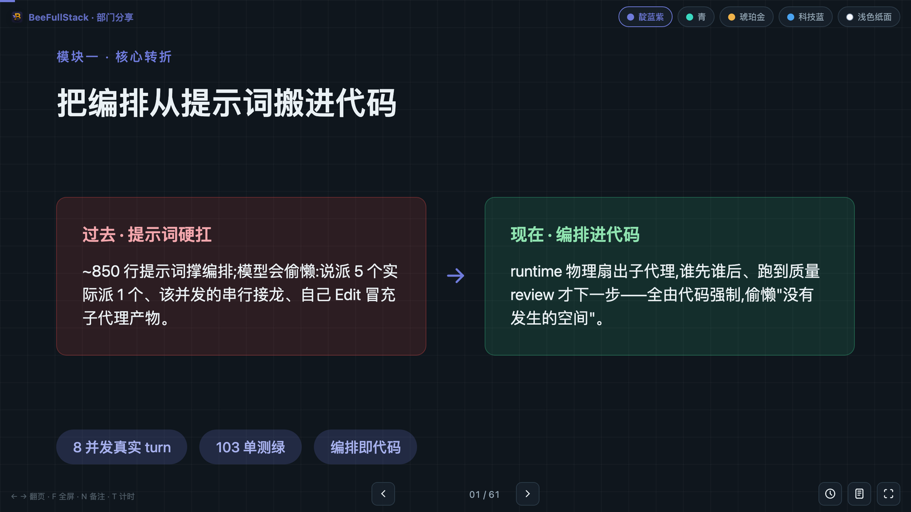

过去，BFS 靠近千行提示词去约束「派 5 个子代理、跨阶段串行、跑到质量门槛再进下一步」。但实际发现，主Agent行为并不可靠，大模型的下一步推理，去赌这个十分不靠谱，模型总会偷懒：嘴上说派 5 个，实际只派 1 个；该并发的接龙成串行；甚至自己动手改文件，冒充子代理的产物。这会大大降低AI生成物质量，导致越走越偏。

于是，我把编排逻辑搬进了一段 Swift 编排代码（一个 DAG 调度器）。任务依赖、扇出数量、完成判定，全部由代码循环执行。模型不再是「派发者」，它只在每个被建好的子会话里干自己那一份活。

主 Agent 像总控台，盯住目标、阶段顺序和最终放行；子代理则是临时开的「分会场」，各做各的，做完把结果交回主线。这些子代理一共 9 个，分三组各司其职：**准备组**（建目录、定 owner、提取视觉稿、路由知识）、**产物协作组**（spec / plan / tasks 三种产物各有唯一作者，谁都不越界写别人的）、**执行与审查组**（写代码的和挑错的分开）。一父派五子，实测 5 个子会话 5.2 秒内全部建好。这样一来，「说派 5 个实派 1 个」就不是「说服模型别这么干」的问题了，而是**物理上没有发生的空间**——要建几个会话，由数据决定、由代码执行，事后还能从数据库里数出真有几个。

其实本质上就是把每一条「偷懒路径」逐个堵死，用已有工具套用传统软件工程知识，来从另一个角度约束AI行为。

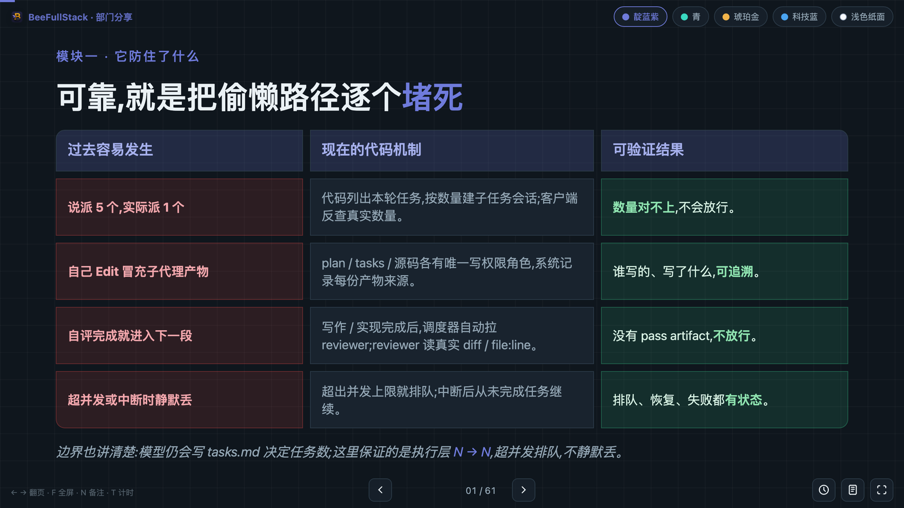

| 过去可能出现的偷懒 | 现在对应的机制 |
|---|---|
| 说派 5 个、实际只派 1 个 | 代码列出任务、确认真实子会话数量，事后可从数据里数出来 |
| 自己动手改文件，冒充子代理产物 | 每类产物（plan / tasks / 源码）各有唯一的写权限角色，并记录来源 |
| 自评「完成」就放行 | 写作 / 执行跑完，调度器自动拉起审查者读真实 diff 和 `file:line`，跳不过 |
| 超并发或中断时静默丢任务 | 超出并发上限就排队，中断后从未完成处继续，不静默丢 |

### Loop Engineering：给每一步装一个会反驳的环

光有编排还不够。编排保证流程不被跳过，但产物对不对，还得有人挑刺。于是我在两个关键节点各装了一个**只读、不动手、只产出问题清单**的审查循环。

其实Loop理念虽然看上去是最近出现的比较火的话题，但其实每个去搞AI工作流的应该都搞过各种意义上的Loop，只是自己可能都没发现而已。

考虑成本+约束AI行为+提高AI产物质量的角度，我从`Plan`和`Code`两个层面进行了审查，通过不同模型的碰撞，来达到我的目的。

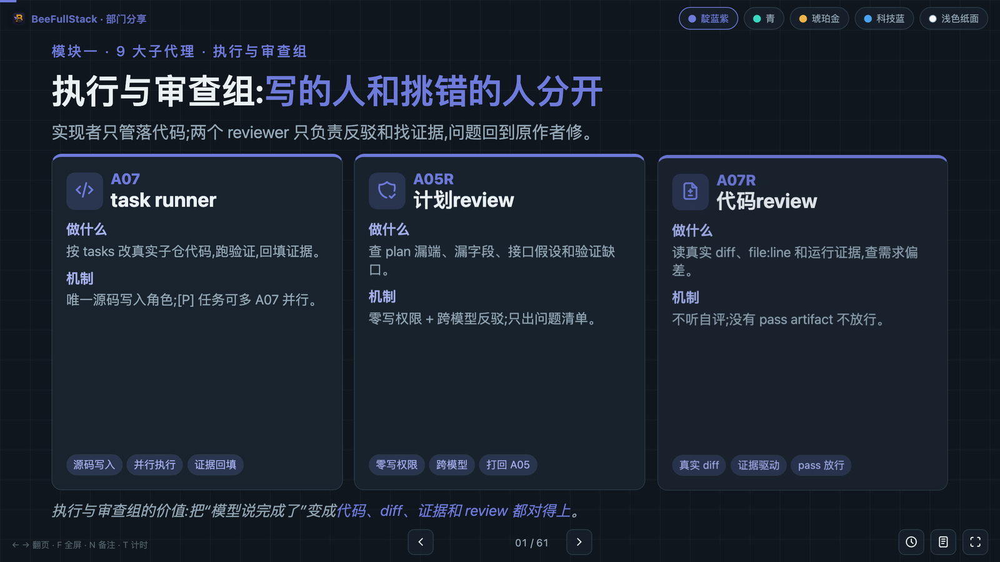

- **计划审查（A05R）**：plan 一写完，先被一个只读子代理审一遍，打回给原作者改。一个真实例子里，plan 自评满分，审查却发现它把改动范围明显低估，还引用了一个根本取不到的字段——这些都在写代码之前被拦了下来。
- **代码审查（A07R）**：所有实现跑完后，再读真实 diff 审一遍「需求符合度 + 代码质量」。另一个需求的代码能正常编译、看着也像做完了，审查却逐条抓出一批问题：接口字段读错层级、空结果被当成功显示、撤回后旧状态没清理……没有一条是语法错，全是「看着对、其实不对」。

这里有一个比较有意思的，但很重要的发现：**让两个不同的模型审同一份代码，抓出的问题几乎不重叠**——一个盯布局和状态，一个盯需求细节和正确性。所以审查环不仅要装，还要让写的人和审的人用不同模型，立场对立，才能碰撞出真问题。成本上，强模型只放在审查节点（每个需求跑一两次），写作和执行仍走便宜模型。

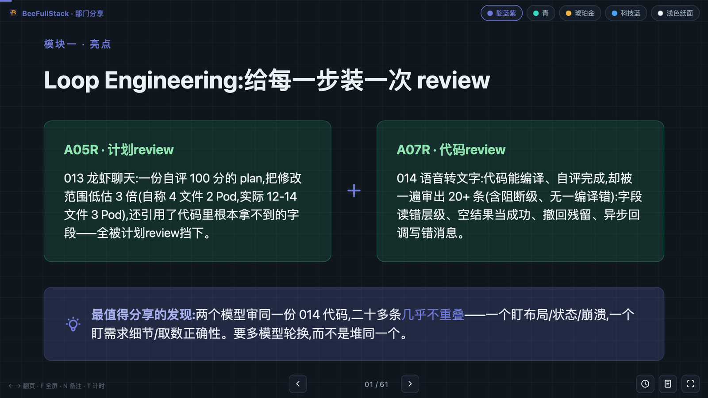

这就是我说的从 Prompt Engineering 到 Loop Engineering：不是把提示词写得更长，而是给每一步装一个会反驳的环。但是也要结合自身工作流的情况去设计Loop，还是那句话，任何概念都是工具，适合自己的才是重要的，不要为了设计而设计，为了迎风热潮而重度设计。

甚至AI给我的方案是每一个产物都加审查环节，但我觉得这个严重的拖慢了需求开发的进度和速度，得不偿失~

---

## 模块二 · 知识驱动：AI四象限

看到过一个不错的观点，AI和人类协作也可以用四象限原理来说明关系。

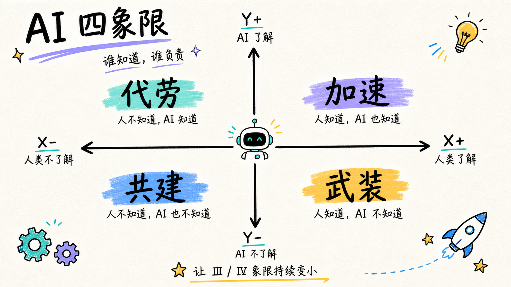

X轴是人类了解和人类不了解，Y轴是AI了解和AI不了解。
第一象限我知道的AI也知道，那么我们就可以利用AI工具加速重复性劳动，解放自己。
第二象限我不知道的AI知道，那么就是传统意义上Agent的能力了，像豆包 像ChatGpt，像我不会修图做视频，我让AI来代劳。
第三象限我不知道的AI也不知道，那就是共建，我来学习新的知识，教会AI，共同成长。
第四象限我知道的但是AI不知道，那就是我们的业务领域知识了，工程定义结构常识踩坑，这些都是大模型不了解的。

随着时间的增长，X轴越来越下，因为AI知道的越来越多，而我们也要力争Y轴越来越左，第三象限会越来越小。

因此对于当前所处的第四象限的绝大多数人，都在做着相同的或者类似的事情，用知识武装AI。知识库这个问题讨论了好久了，我个人依然认为是必要的，至少在这个混沌元年是必须的。

### 不给工程认知，AI 就会一本正经地编

大模型往往不会说「我不知道」，而是**自信地编**一个看起来很合理、实际并不存在的类名、接口或路由。更麻烦的是，它还会把工程里的老代码、或别的工程里的过期写法学来用错。

解决办法不是更长的提示词，而是给它建立可靠的工程认知。这件事我拆成两条互不混淆的链路：
**「找知识」**（为写文档找上下文，读各端的参考资料）
**「找代码」**（为定位真实实现，图谱优先、逐级降级）

定位代码时走「三级联查」，命中即止：

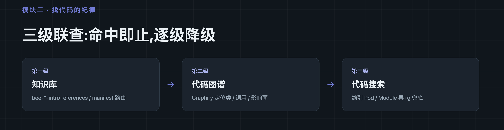

先查知识库，再查代码图谱，最后才退回到全局搜索。越往左越准、越省 token；就算某个端还没有图谱，流程也能自动降级照常跑。

### Graphify：给代码建一张「关系网」

「代码图谱」具体是什么？把代码里的类、函数当节点，调用和依赖当边，连成一张网；再做社区聚类找出模块边界，标出「牵一发动全身」的高影响节点（God Node）。

到现在，这张网已经覆盖了多端真实工程，并且接进了五段流程：plan 阶段用它生成「零搜索启动」的上下文地图，tasks 阶段用它做依赖分析和高影响节点回归提醒，archive 阶段自动增量更新——不用每次全量重建。具体仓库范围、模块规模、节点数量和边数量不适合放在公开文章里展开。

知识不是写一次就完事，它是「活」的。每端有一套结构化的参考资料，带元信息路由，AI 命中关键词才读对应篇；归档时把踩过的坑回流进去，下一个需求就更准。

### 一个具体例子：AI 要给既有模块加一个入口

抽象的流程不如一个真实例子。假设产品说「在一个已有发布链路里加一个新入口」，AI 不会一上来就全局搜代码，而是先命中对应端的知识库，读懂这个模块的关键结构；再去查代码图谱，确认哪些配置类、入口视图或高影响节点需要谨慎处理；最后才读真实源码做最小验证，把定位结果写进 plan 的上下文地图。

整个过程命中即止——能在知识库和图谱解决的，就不必去翻几十万行源码。这就是两次交付质量差距里，知识这一层贡献的差距。

---

## 模块三 · 客户端：把这一切装进一个易用的工作台

CLI确实好用，但我还是感觉我需要一个易用的GUI，面对茫茫多的命令，skill，或者需求范式，我感觉我记不住，有时候都忘记了步骤，下一步我要干嘛的那种茫然，于是我还是坚持做了一个SDD范式的客户端+Agent Coding工作台，也满足了全栈需求开发多端管理的需求。

### 一站式：需求到归档，一个工作台跑完

客户端不是一个聊天框，而是承载整个闭环的工作台：需求产生 → 拆解 → 工作流开发 → 多端实现与调试 → 归档 → 知识回流，再回到下一个需求。

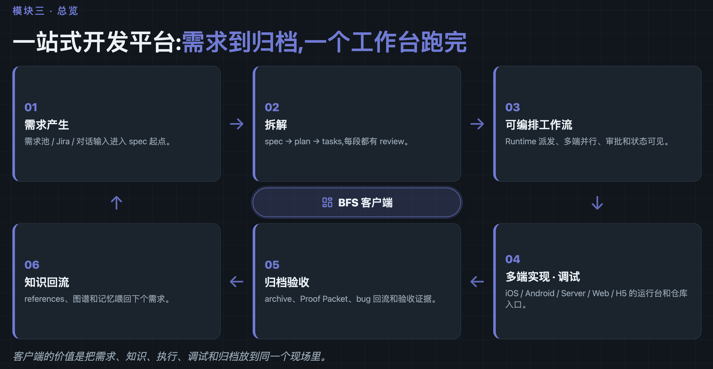

4 月 25 日第一个 MVP，7 周迭代成一个有 9+ 能力的桌面工作台。它把前面两个模块的东西都收了进来：工作流引擎、多端扇出、子代理实时状态、审批卡、图谱入口、知识库入口、运行台和归档助手，都不再散落在终端、IDE、Jira 和各种文档之间。

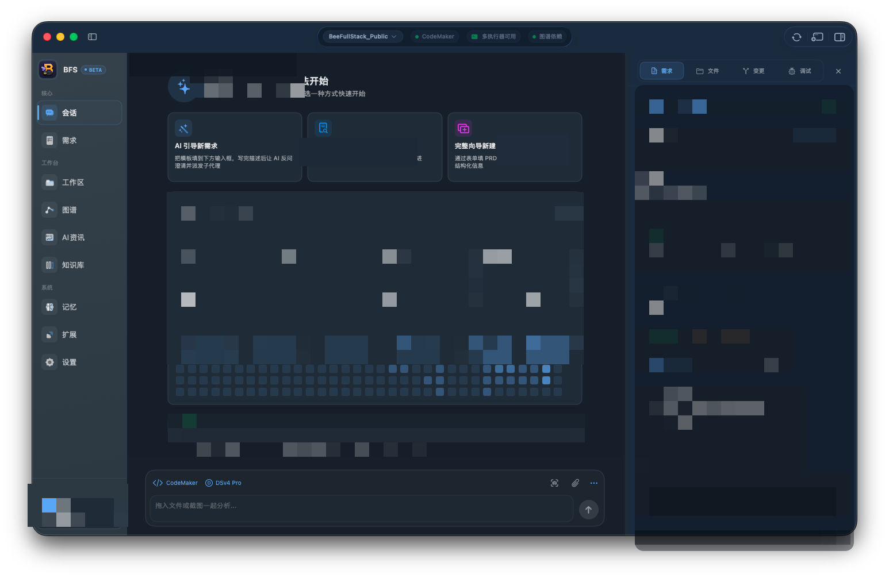

代码写完要跑起来看。各端的真机和模拟器可以在工作台里直接运行、编译、安装、启动并看日志——不必同时开着 Xcode、Android Studio 和一堆终端来回盯，常规运行和实时日志都收进了一个地方。

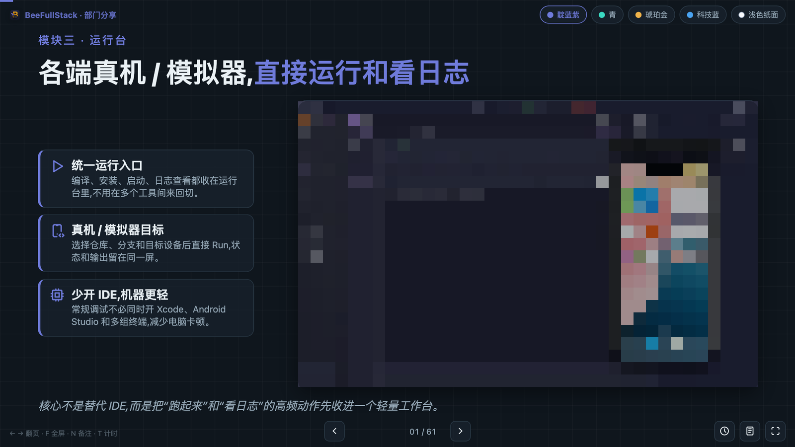

需求本身也在这里拆解和管理。每个需求扫成一张列表，带阶段徽章（spec → archive）、各端进度和任务进度条；新建需求有专门的表单，多人协作时按页面切片、各自负责各自的 module，物理隔离不互相打扰——这些是传统 Jira 工单和看板撑不起来的。

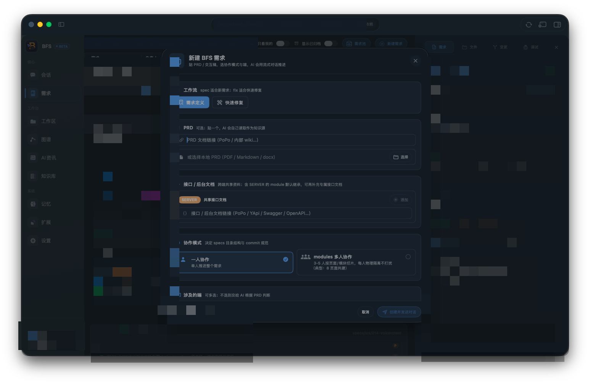

**一个客户端，三种 agent 随会话切换。** 输入框收敛成两个主控——执行器（CodeMaker / Claude Code / Codex）和模型，按会话切换底层 agent runtime，复用本机一个统一网关做 provider 路由。好处有四个：统一路由控成本（低成本白名单 + 本地用量记账）、配置可恢复（默认不写盘，显式应用才改全局配置并带标记，一键还原 + 审计）、历史不串线（外部会话本地建索引、合并展示可续接）、以及五段工作流仍锁定在稳定的后台服务上，切 CLI 不影响编排稳定性。

**两种工作模式，互不污染。** BFS 模式（大脑仓）= 多仓控制台 + 五段需求体系 + 本地记忆 + 根图谱；Repo Native 模式（单仓）= 直接进任意子仓，AI 看自己的代码、认子仓自己的 SDD 约定和 skills、用独立的需求页。两套物理隔离：单仓模式一行都不碰大脑仓的需求体系。这样一个客户端既能跑 BFS 结构化的五段，也能即开即用地当任意单仓的通用 AI 工作台。

此外还有一批实在的能力：丝滑的流式卡片化对话、等待消息队列（模型还在说，你的想法可以先排进队列、它一停就按序发出）、本地的 AI 资讯流，以及把多窗口、流式渲染、多端扇出都串在一条链路上的本地后台服务 + 事件流底座。

一句话：CLI 适合干活，GUI 适合观测和驾驭，两者不替代。

---

## 模块四 · 上游协作：正确率的天花板，在我们喂的稿子里

相信大家也在过去一段时间内做了很多SDD需求了，也有一些自己的痛点，我的话感觉整个BFS工作流属于中游，而产品文档 视觉稿 交互稿 属于上游，自动化测试和验收属于下游，下游的事情我觉得还好，现在还没到很急迫的地步，但是上游的产物质量是真真切切很急迫的。

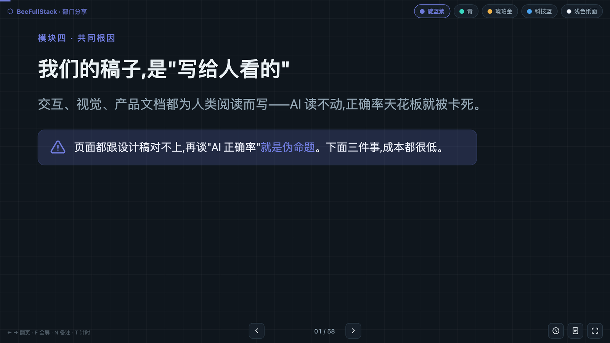

共同的根因是：我们现在的稿子，都是「写给人看的」，AI 读不动。页面跟设计稿对不上，再谈正确率就是伪命题。于是有三个低成本、但收益很高的协作请求：

- **交互稿**：元素堆满一页，AI 抓不住主线。希望能配一份「操作流」——从哪进、点什么、到哪去、什么状态。产品/交互补一页，成本很低。

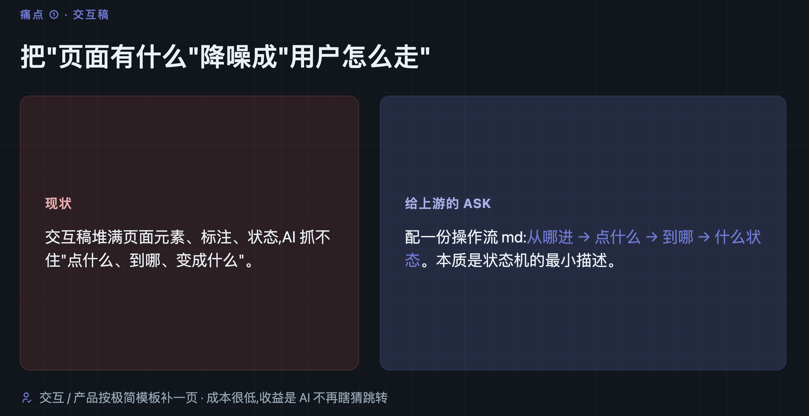

- **视觉稿**：Figma 直接给 AI 提取又慢又不稳，而且没有一份可复用、可留存的视觉参考，每次都得重提。希望有命名约定 + 设计 token，把视觉「代码化」一次、长期复用。

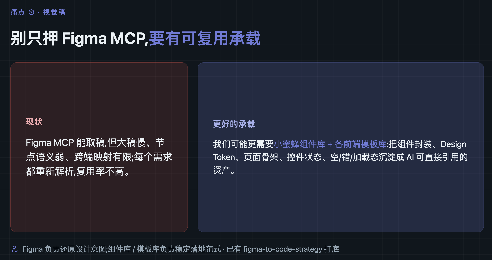

- **产品文档**：只写「终态」，不写「改了什么、不能破坏什么」。AI 不知道改动边界，就容易破坏既有逻辑。希望用「现状 / 变更 / 不可破坏项」三段式来写，让 AI 知道何时必须怎样做。

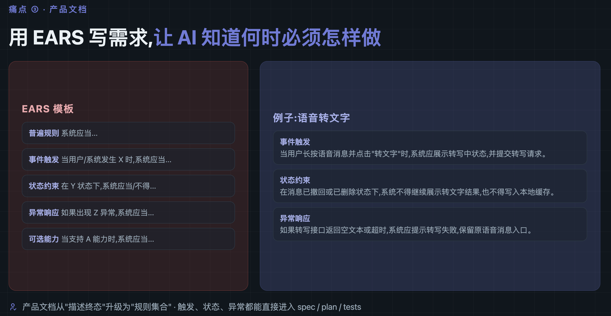

这一块不是技术问题，是协作问题，也是这三个月里我觉得最值得跨职能一起推的事。

---

## 三个月，其实是一句话

如果把这三个月浓缩成一句话，就是：

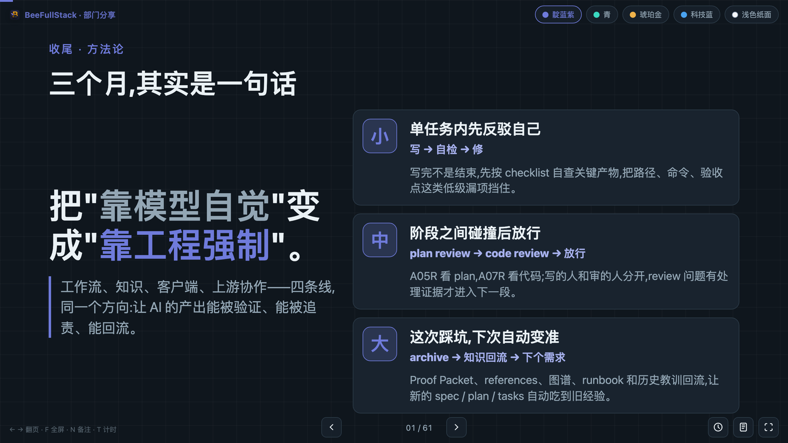

> 把「靠模型自觉」变成「靠工程强制」。

它具体落成三层会反驳的循环：单任务内「写 → 自检 → 修」（小循环）、阶段间 plan / code review 碰撞后放行（中循环）、需求间 archive 知识回流让下次更准（大循环）。工作流、知识、客户端、上游协作——四条线，同一个方向。

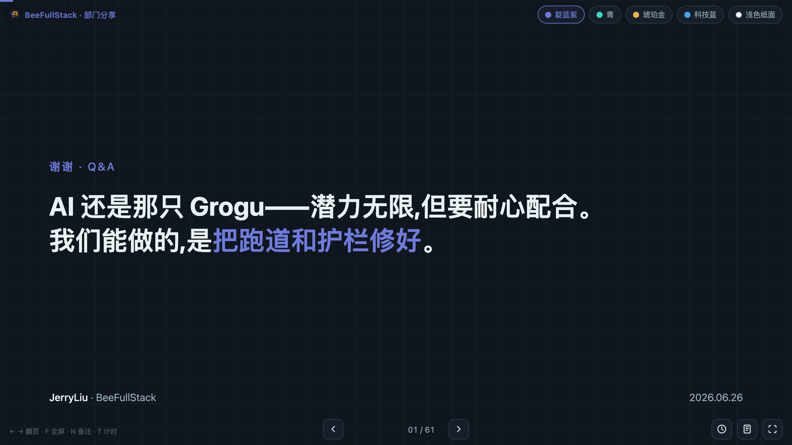

AI 还是那只 Grogu——潜力无限，但要耐心配合。我们能做的，是把跑道和护栏修好。
