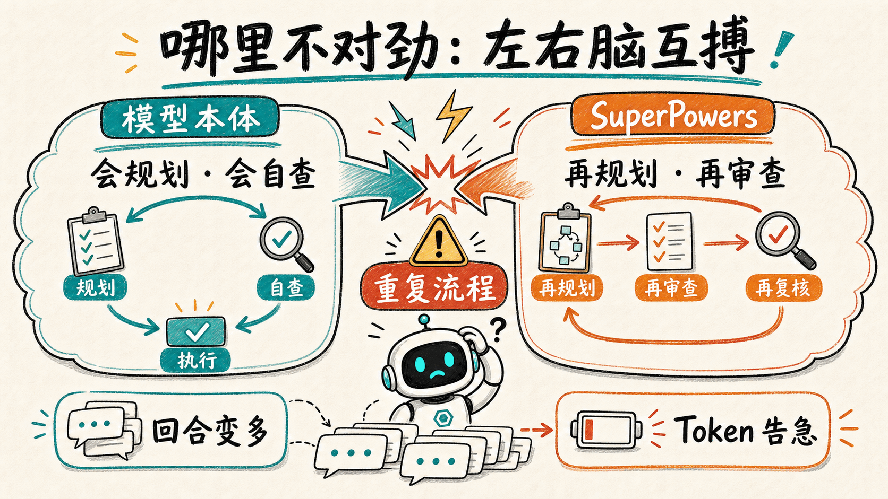
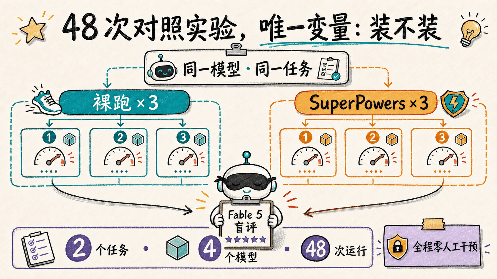
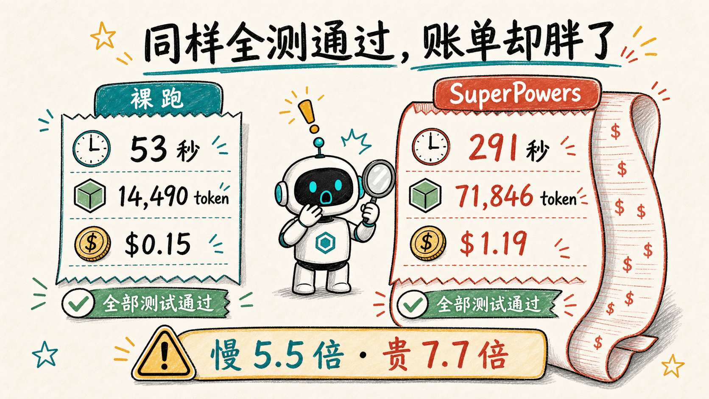
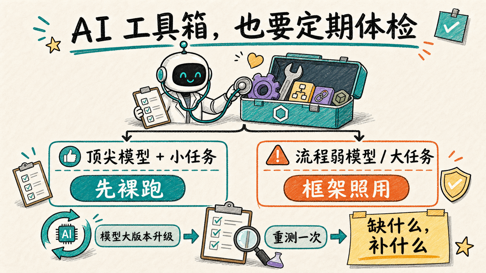

## 一、先说结论

Superpowers 这个 AI 编程框架，我真实使用了一段时间——在 SDD（规格驱动开发：先把需求和计划写清楚、再动手写码）的萌芽时期，它着实表现得很出色，也顺理成章地成了我工作流当中的好队友。这个月，我花 32 美元、跑了 48 次对照实验，给这位老队友做了次体检。报告出来，两项指标严重超标：

- **同一个模型、同一个任务，装上这个框架之后：干活时间变成 5.5 倍，消耗变成 5 倍，账单变成 7.7 倍。** 产出的代码，两边都能通过全部测试。
- **模型越新，这笔"框架税"越重。** 上一代模型交 2~3 倍的税，最新一代交 3~8 倍。

说到被 AI 坑，大家最先想到的多半是编造事实、代码上线就崩这类看得见的坑。这次我掉的坑更隐蔽——没有报错、没有翻车，产出一直是对的，只是账单在悄悄变厚：**坑我的不是 AI，是我装上它之后，就再也没有重新判断过。**

## 二、实验是怎么来的

### 2.1 先把四个名词讲清楚

怕有同学没接触过，先把四个名词讲掉，后面就顺了。

**Superpowers**：一个国外老牌开源开发者写的 AI 编程框架，可以理解成给 AI 助手请了个严厉的项目经理——强制 AI 先访谈需求、再写计划、先写测试再写代码、每步都要自查。今年上半年它在圈内很火，我也用了一段时间。

**GPT-5.6-sol**：OpenAI 在 7 月 9 日刚发布的旗舰模型（sol 是它的最大杯），也是这次实验的主角。它的宣传重点之一，恰好就是"自己会规划、自己会检查，每一分算力都花在刀刃上"。

**Token**：AI 的计量单位，你可以粗暴理解成"AI 说的每个字都要花钱"。干同一件事消耗的 token 越多，就意味着越慢、越贵。

**Claude Fable 5**：Anthropic 刚发布的旗舰模型，公认的另一位顶尖选手。它在这次实验里不下场比赛，只当裁判——48 份代码全部由它盲评打分。选一个不在参赛名单里的模型当裁判，就是为了避免既当运动员又当裁判。

冲突就藏在前两个名词之间：**Superpowers 教 AI 守流程，而新模型出厂时已经被训练过流程了。** 一个已经会自觉预习、自觉复习的学生，你再给他配一个逼他预习复习的家教，会发生什么？这就是实验想回答的问题。

### 2.2 哪里不对劲：从额度告警到"左右脑互搏"

事情的起点不是什么宏大的技术判断，是一张额度告警。

7 月初，我把 Codex 的默认模型切到了刚发布的 GPT-5.6-sol。按理说模型更强，活应该干得更快，但体感恰恰相反：同样量级的任务明显变慢了，订阅的五小时 token 额度以肉眼可见的速度见底——以前一个下午都用不完，现在两三个任务就告急。

第一反应是"新模型嘛，贵点认了"。但慢得不对劲：不是它响应慢，是回合多——它在我看不见的地方来来回回干了很多事。于是我翻开运行记录里的思考过程，看到了大量 Superpowers 的 skill 调用：任务还没动工，它先加载头脑风暴技能、再加载写计划技能，一步一停，像开工前先开了三场会。

那一刻我脑子里冒出一个词：**左右脑互搏**。左脑是模型本体——出厂时就被训练过"先规划、再动手、后验证"；右脑是我此前装上的框架——用另一套话术规定着同样的事。两套流程叠在一起，谁听谁的？我付的钱里，会不会有一大半花在这两半脑子互相商量上？

体感和怀疑都不能当证据。于是：**别猜了，测一下。** 事后看，这个决定就是这次"重新做人"的开始——体感可以骗人，数据不会。

### 2.3 实验设计（一页纸讲完）

设计很朴素：**同一个模型，同一个任务，唯一的区别是装不装 Superpowers，各跑三遍，看数据。**

- **两个任务**：一个是"从零写个小工具"（一个 Markdown 目录生成器，带 10 条验收规格）；一个是"修别人的烂摊子"（一段埋了 2 个真实 bug 的限流代码，要求最小化修复再加个小功能）。一个考从零搭建，一个考读码排障，都是日常开发的缩影。
- **四个模型**：GPT-5.6-sol 和它的上一代 GPT-5.5（走 Codex 命令行），再加 DeepSeek 和 GLM 两个模型（走另一套命令行工具）做参照。
- **公平性**：每次运行都在全新的隔离环境里，任务书逐字相同；打分由前面介绍的裁判 Fable 5 **盲评**——它看不到每份代码出自哪个模型、装没装框架，只按 10 条固定标准逐条打勾。
- **规模**：一共 48 次运行，全程零人工干预，总花费 32 美元。

有四句丑话必须先说，这也是数据的边界：每种组合只跑了 3 次，结论是方向性的，不是定律；两个任务都偏小，四个模型裸奔都能做对，所以**这次实验比不出"谁质量更高"，只能比出"谁花的代价大"**；Superpowers 在不同命令行上的版本略有差异，跨模型的对比只看相对倍率；其中 Codex 侧官方市场分发的还是较老的版本（5.1.3，早于作者 6 月中的一轮性能优化），所以文中的税率对框架来说是偏严的测法。

## 三、数据怎么说

两个任务、48 次运行，最后都指向两个论点。

### 3.1 论点一：在最新的顶级模型上，Superpowers 成了一张纯税单

从修 bug 这个任务说起。GPT-5.6-sol，装与不装 Superpowers 各跑三遍取平均：

| 指标 | 不装 Superpowers | 装 Superpowers | 倍率 |
|---|---|---|---|
| 耗时 | 53 秒 | 291 秒 | **5.5 倍** |
| token 消耗 | 14,490 | 71,846 | **5.0 倍** |
| 对话回合数 | 6 | 27 | 4.6 倍 |
| 费用 | $0.15 | $1.19 | **7.7 倍** |
| 测试是否全过 | ✅ | ✅ | 持平 |

"从零写工具"任务上，同样的故事：耗时 158 秒 → 468 秒，token 33,397 → 113,290，费用 $0.41 → $1.91。

一分钟能干完、一毛五能结账的活，装上 Superpowers 变成五分钟、一块二。**多花的四分钟和七倍的钱买到了什么？在我们这两个任务上：买到了更长的计划文档、更多轮的自我审查记录，以及一份和裸奔版同样通过全部测试的代码。**

单独看这一组，你可以说"贵有贵的道理，流程严谨嘛"。真正让我坐不住的是下面这张对照——**同样的 Superpowers，放在上一代模型 GPT-5.5 上，税率完全是另一个量级**：

| 框架税（装 Superpowers 后的增幅） | GPT-5.5（上一代） | GPT-5.6-sol（最新） |
|---|---|---|
| 修 bug：token 增幅 | +98% | **+396%** |
| 修 bug：耗时增幅 | +144% | **+447%** |
| 写工具：token 增幅 | +108% | **+239%** |
| 写工具：耗时增幅 | +134% | **+197%** |
| 费用倍率（两任务） | 2.9 倍 / 2.7 倍 | **7.7 倍 / 4.7 倍** |

于是有了这次实验里我认为最靠谱的第一个结论：

> **结论一：这套流程框架的开销不是常数，而是随模型换代上涨的。模型越新越强，装同一个框架付出的相对代价越大——在我们的任务上，从上一代到最新一代，税率大约翻了一倍到两倍。**

换句话说，"Superpowers 变得又慢又贵"不是错觉，也不全是它的错——是它和新模型的组合出了问题。

### 3.2 论点二：模型已经会的课，框架还在收学费

税为什么越来越重？光看账单猜不出来，得看过程。我们给全部 48 份运行记录做了行为标注：动手前有没有先给计划、有没有先跑测试、交卷前有没有自己验证。

先看不装框架时，四个模型各自在干什么（每个模型 6 次裸奔运行的行为统计）：

| 裸奔时的自觉行为 | GPT-5.6-sol | GPT-5.5 | DeepSeek | GLM |
|---|---|---|---|---|
| 动手前先列计划 | **5/6** | 5/6 | 4/6 | 0/6 |
| 先写测试再写代码 | 2/6 | 3/6 | 3/6 | 3/6 |
| 自己跑测试验证 | **6/6** | 6/6 | 6/6 | 6/6 |
| 交卷前自查一遍 | **6/6** | 6/6 | 1/6 | 1/6 |

两代 GPT 裸奔时，列计划、自测、自查已经接近满勾；两个国产模型会自测，但很少自查。有一次修 bug，5.6-sol 的开场白就是"先定位、再最小修复、补上针对性测试、最后跑全量验证"——这套动作没有任何人教它，53 秒干完，满分交卷。

这正是要害：**Superpowers 教的那几门课，越强的模型出厂时学会的越多**（表里唯一普遍没养成的习惯是"先写测试"——记住它，下文会再出现）。给已经会的学生塞课本，会发生两件事：

第一件事，重复上课。它会认真配合框架把已经会的流程再走一遍——于是回合数从 6 涨到 27。

第二件事，师生打架。我们统计了运行记录里"框架要求和现实条件顶牛"的冲突事件：**不装时发生率 12.5%，装上之后涨到 45.8%。** 两个真实例子，翻译成人话：

- Superpowers 规定"必须访谈用户、拿到批准才能动工"，但任务说明里写着"无人值守，自己决策"。模型在记录里无奈地写道：*批准环节和"不要等用户"冲突了，我只好自行推进。*——它花了 token，就为了给自己写一份"为什么不遵守流程"的说明。
- 它要求把活分派给"子代理"（AI 的分身），但环境没给分身授权。模型又写：*本任务未授权子代理，跳过分派。*——这次运行跑了 34 个回合、9 万 token，是同任务裸奔版的 6 倍。

顺带一个有意思的发现：参照组里的 DeepSeek，装了 Superpowers 之后 **6 次里有 4 次没有触发它**，按自己的节奏把活干完了，税自然也没交多少。这提醒我们：**“装了框架”和“框架在起作用”是两回事**——前者是配置项，后者要看模型买不买账。

所以第二个结论是：

> **结论二：流程框架的价值建立在"模型自己不会守流程"这个前提上。这个前提正在失效——对已经内置了流程习惯的新模型，框架的规则和模型的本能互相踩脚，多付的 token 有相当一部分花在了"协商该听谁的"上，而不是解决问题上。**

也要把话说全：这份税单是在两个小任务上测出来的，而 Superpowers 的价值本来就不在"一分钟能干完的活"上。在那种横跨几十个文件、需要拆解分工、一步走错就全盘返工的大任务上，先访谈、先计划、层层审查的纪律恰恰是防翻车的保险——这类场景本次实验没有覆盖，税率不能照搬。数据里它也确实有实打实的收获：把"先写测试再写代码"的执行率从 46% 提到了 92%（就是前面让你记住的那个短板）。如果你的任务够大、对过程合规有硬要求，或者你用的模型流程习惯还没养成，这笔税仍然值得交。

而且这些问题，作者比我们更清楚。他在 6 月中旬的发布日志里直言"用户最大的抱怨就是又贵又慢"，随后连着三个版本都在对症下药：6.0 重写了最烧钱的审查环节（自评快了约一倍）、6.1.0 专门压缩每次会话都要付费的引导文本；社区也在推着改——就在本文成稿前一天，还有用户提交了"一个任务跑 4 小时烧掉 1.2 亿 token、缺熔断机制"的问题报告。也就是说，这不是一个装死的项目，而是一个在追赶模型进化速度的项目——只是从我们的账单看，这场赛跑目前是模型跑在了前面。

**所以问题不是"框架好不好"，而是"你的模型还需不需要它"。**

### 3.3 一些小Tips

把两个论点落到操作上：

1. **顶尖模型，先裸跑再说。** 像 GPT-5.6-sol、Claude Fable 5（给本次实验当盲评裁判的那位）这类旗舰模型，出厂就自带"计划—执行—自查"的习惯（见 3.2 的行为表）。建议默认不加载 Superpowers 这类重流程框架：先裸跑看效果，不满意再按"缺什么补什么"加轻量规则，重框架永远是最后的选项，而不是第一个。我自己的做法是：在一个工具里卸载重流程插件，只在确实需要流程约束的环境里保留轻量版本。
2. **流程习惯弱的模型和大任务，框架照用。** 如果模型还没养成流程习惯（行为表里很少自查的那一类），或者任务大到一步走错就整体返工，Superpowers 的纪律仍然是划算的保险——不能拿小任务的税单把它一棍子打死。
3. **装了不等于生效，生效不等于永远划算。** 隔一阵翻一眼运行记录（框架有没有真被触发）和账单（税率有没有异常上涨）；模型每次大版本升级，重测一次——本文的实验方法就是现成的模板，两天、32 美元。

## 四、「坑后感」

这次坑给我的教训，不在 AI 身上，似乎随着模型的越来越强，AI带给我的坑从之前的小而蠢，变成了现在不仔细观察甚至都发觉不了。这再一次回归到了之前讨论的一个话题，人与AI协作的长期磨合阶段，人的参与感我认为还是很关键的，我们应该花时间精修AI的种种行为，无论是Harness还是Loop工程。
但是我们也要警惕我们曾经认为好用的Harness 是否过度设计，是否依然好用，小到 `Vibe Coding`、大到`自定义工作流`，在切换模型这件事上还是要谨慎，及时发现不对劲的地方，并加以纠正。

结合 TASTED 六力清点了一遍，我在这个坑里意识到的是这三样：判断力、标准感、结构力。

**第一，判断力不是"判断一次"，是"定期重新判断"。** 当初装上它没有错——在当时的模型上，它是划算的。错的是装上之后，我把“当时划算”默认成了“永远划算”。AI 圈现在三个月换一个时代，任何"最佳实践"都自带保质期。现在我给自己立了条规矩：**大模型每次大版本发布，就给自己的工具箱做一次体检。**

**第二，标准感是"知道什么时候该拆"。** 我们习惯给 AI 加规矩、加流程、加框架——加的时候都有道理。但很少有人给这些规矩记折旧。这次实验后我回头审视自己团队的 AI 工作流，把每条规则分成两类：教 AI "怎么干活"的，随模型换代要重估甚至删掉；告诉 AI "我们这里有什么、什么不能碰"的，才是不折旧的资产。

**第三，结构力是"把怀疑变成可复跑的实验"。** 这次实验从设计到出数据只用了两天、32 美元，比我在群里跟人吵一周便宜多了。方法完全可以照抄：同一个任务、唯一变量、各跑三遍、找个局外人盲评。下次你怀疑某个 AI 工具"好像不对劲"的时候，别辩论，测一下——**账单和秒表不会站队。**

而在这六力里哪一项最容易被 AI 掩盖？我的答案是**判断力**——AI 用得越顺手，你越感觉不到自己已经很久没有重新判断过了。流程在跑、计划在刷屏、自查报告一份不少，一切都有"很靠谱"的手感，直到你翻开账单。这次的 32 美元，就是我补交的判断力学费；比起被那种“很靠谱”的手感掩盖过去的这段日子，这学费不算贵。

---

## 附：数据与方法

- 本文来自一次内部可复跑对照实验；为避免暴露内部路径、仓库地址和原始运行记录，公开版只保留汇总指标和结论。
- 文中所有倍率均为同一模型、同一任务、装/不装框架各三次运行的均值之比；费用为 API 牌价折算。
- 关于作者侧的优化动态：见 [Superpowers 项目](https://github.com/obra/superpowers) 的 v6.0.0 / v6.1.0 发布说明与[作者博客](https://blog.fsck.com/2026/06/15/Superpowers-6/)；"4 小时烧掉 1.2 亿 token"的社区反馈见该项目 2026-07-14 的公开 issue。
