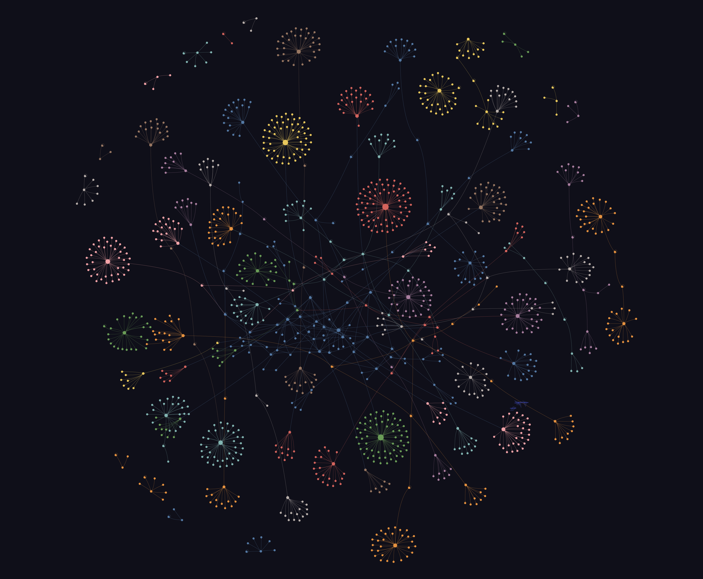

### 0.前言

Hi 大家好，我是小杰瑞。

最近和隔壁一支偏 AI 驱动的研发团队交流时，听他们聊到了一个挺有意思的变化：他们把 `Graphify` 引进到了日常研发工作流里，而且不是单独把它当成一个“分析代码的小工具”，而是实打实的塞进了`需求分析`、`方案设计`、`代码实现`、`问题排查`这一整条链路里。

我听完之后最大的感受是，这件事真正打动人的地方，并不是“又多了一个给 AI 用的工具”，而是它想解决一个更本质的问题：**AI 其实一直都不够了解你的工程。**

这一点在 iOS 开发里尤其明显。很多时候 AI 不是不会写代码，而是不知道该从哪一个入口开始改，不知道这个页面背后到底挂着几个状态源，也不知道一个看上去很小的改动会不会连带着影响到 `Widget`、`Extension`、`App Intents` 甚至一些历史模块。于是我们经常会拿到一种结果：看上去像是对的，真往工程里接的时候又总差点意思。

而 `Graphify` 这类工具，我觉得价值恰恰就在这里。它让 AI 对代码库的理解，从“看见几个文件”往前走了一步，变成“看见这些文件之间是怎么连起来的”。

不过如果只聊这一句，那这篇文章就有点像一句空话了。所以这篇文章我还是按三个问题来展开：

1. `Graphify` 到底是什么。
2. 它在实际开发里到底怎么用。
3. 一套 AI 工作流是怎么把它接进去的。

文中涉及到的一些团队信息、目录结构、模块名字和规模数据都做了脱敏处理，重点还是只放在思路和体验本身。好了，废话到这里，开始今天的主题。

## 目录

1. [AI 辅助编程最大的问题](#ai-context-problem)
2. [Graphify 是什么](#what-is-graphify)
3. [Graphify 怎么用](#how-to-use-graphify)
4. [BFS 是怎么把 Graphify 接进工作流里的](#bfs-graphify-workflow)
5. [为什么这件事对 iOS 开发尤其有价值](#why-ios-benefits)
6. [站在 iOS 视角的几个受益场景](#ios-scenarios)
7. [当然，它也不是万能的](#limitations)
8. [写在最后](#closing)

<a id="ai-context-problem"></a>

## 1. AI 辅助编程最大的问题，不是生成，而是不了解工程

过去这一两年，大家其实已经非常习惯让 AI 帮忙写代码了。写一个方法、补一段逻辑、起一个页面骨架，甚至给一个重构建议，它很多时候都能给出一个看上去还不错的结果。

但只要项目稍微大一点，问题就会慢慢暴露出来。

比如它可能会：

1. 写出语法正确、但项目里根本不存在的类型和 API。
2. 改了当前文件，却漏掉真正相关的调用方和被调用方。
3. 给出一个理论上可行的方案，但和当前工程的分层完全不匹配。
4. 只看到了页面层，却没意识到这次改动还会影响埋点、路由、缓存、扩展目标和状态同步。

说到底，这些都不是“模型不够聪明”的问题，而是**上下文不完整**的问题。

对于一个成熟的 iOS 工程来说，真正重要的信息往往不是某一行 Swift 或 Objective-C 代码本身，而是它所处的位置：它属于哪个模块、被谁调用、依赖哪些协议、和哪个 Target 共用、有没有历史包袱、是不是一条高影响链路上的节点。这些信息，单靠丢几个文件给 AI，通常是很难补齐的。

所以我现在越来越觉得，AI 辅助编程的上限，从来都不只由模型决定，更由“你给它的工程理解层”决定。

<a id="what-is-graphify"></a>

## 2. Graphify 是什么

如果用一句比较直白的话来概括，我会觉得 `Graphify` 更像是在代码库和 AI 之间，加了一层“结构化翻译”。

它做的不是替你写业务代码，而是把原本散落在工程里的结构信息、依赖关系、调用链路、模块边界，用一种更适合机器理解的方式重新组织起来。这样一来，AI 在回答问题、设计方案或者动手改代码之前，就不再只是盯着零散文件，而是能先看到一个相对完整的关系图。

我自己比较认同它的一个定位是：它既不是人工知识库的替代品，也不是传统代码搜索的替代品，而是它们中间的那一层。

大概可以理解成这样：

1. 人工知识库负责沉淀经验、规范和业务背景。
2. `Graphify` 负责把真实代码结构转成可遍历、可关联、可解释的关系图。
3. 实时代码搜索负责做最后的兜底和细节确认。

这个思路其实很像我们自己平时做技术方案的习惯。先凭经验判断方向，再去看工程结构和影响范围，最后回到具体代码里确认细节。只不过以前这套动作更多靠人，而现在 `Graphify` 是把其中很关键的一步，也就是“理解工程关系”这件事，部分前置给 AI 了。

### 2.1 它大概做了什么

如果稍微拆开来看，`Graphify` 做的事情大概是下面这几步：

1. 扫描一个模块或者一个目录，识别里面有哪些代码文件、文档文件和配置文件。
2. 对代码做静态结构提取，拿到类、方法、属性、协议、调用关系、依赖关系这些信息。
3. 把这些信息组织成图结构，也就是“节点 + 边”的形式。
4. 基于图再去做聚类和分析，找出核心节点、功能社区和高影响链路。
5. 输出成机器能查、人也能读的结果。

通常最后会落下几类产物：

1. `graph.json` 这样的图谱数据文件，供程序查询。
2. `graph.html` 这样的可视化结果，方便人去浏览。
3. `GRAPH_REPORT.md` 这样的审计报告，用来快速看模块全貌。

也就是说，它并不是一个只服务 AI 的东西，人自己去看这个结果，其实一样有帮助。

### 2.2 对 iOS 工程来说，它关心的是什么

站在 iOS 视角，我觉得它最有价值的不是“把代码扫一遍”，而是能把下面这些信息尽量提前梳理出来：

1. 页面、状态层、数据层之间是怎么串起来的。
2. 哪些类型是高耦合的核心节点，改动风险更高。
3. 某个功能点背后，真实牵涉到哪些模块。
4. 某条能力链路是否跨了多个 Target，比如主 App、`Widget`、`Extension`、`App Intents`。
5. 某个看上去很普通的类，实际上是不是一条长调用链上的中间枢纽。

这类信息平时并不是看不到，而是得靠经验、grep、反复跳转代码一点点拼出来。`Graphify` 做的事情，就是尽量把这张“拼图”先拼好。

<a id="how-to-use-graphify"></a>

## 3. Graphify 怎么用

如果只讲定义，还是会显得有点虚。更实际一点的问题是：这东西落到日常开发里，大家到底怎么用？

从我看到的做法来看，它的使用方式并不复杂，基本可以分成四类：首次构建、图谱查询、路径分析、增量更新。

### 3.1 第一步：先对模块建立图谱

一般会先对一个目标模块做首次构建。这个模块可以是一个 iOS 子工程、一个业务组件，或者一个相对独立的功能目录。

示意命令大概是这样：

```bash
/graphify ios/MyFeatureModule
```

执行完之后，通常会产出这几类文件：

```text
graphify-out/ios/MyFeatureModule/
├── graph.json
├── graph.html
├── GRAPH_REPORT.md
└── analysis.json
```

这一步的意义不是“生成一份报告”，而是让这个模块从此拥有了一份可复用的结构化上下文。后面不管是人看还是 AI 查，都不用再从零开始扫一遍。

### 3.2 第二步：先看模块全貌，再问局部问题

这一步是我自己特别认同的地方。很多时候我们一上来就把问题扔给 AI，比如“这个功能怎么做”“这个类在哪里改”，其实问题本身就有点太早了。

更合理的方式是，先让它理解模块里有什么，再去问具体问题。

比如可以先做广度查询：

```bash
/graphify query ios/MyFeatureModule "LiveActivity"
```

这种查询更像是在问：“和这个概念最相关的那些节点是谁，它们大概分布在哪几个功能区域里？”

如果你已经知道自己要追一条实现链路，那就更适合做深度查询或者路径查询，比如：

```bash
/graphify query ios/MyFeatureModule "WidgetEntry" --dfs
/graphify path ios/MyFeatureModule "WidgetEntry" "SharedStore"
```

这时候它的价值就不是“告诉你某个类存在”，而是帮助你理解“这两个点在工程里到底是怎么连起来的”。

而如果把这一步再往前推一点，其实它对新人和跨端同学也很友好。很多时候，一个 iOS 模块真正难的地方，并不是代码本身，而是第一次接触时根本不知道它的边界、核心节点和内部社区是怎么分布的。图谱可视化把这些关系直接摊开之后，即使不是这个模块的长期维护者，也能更快建立起整体认知。



上面这类可视化结果，就是一个 iOS 模块跑完图谱之后很典型的效果。中间通常是连接更密集的核心区域，四周则是按功能或依赖关系自然聚合出来的若干社区。对于新人来说，它能帮助快速建立“这个模块大概由哪几块组成”的第一印象；对于其他端或者跨模块协作的开发人员来说，它也能明显降低第一次进入陌生 iOS 模块时的理解成本。

### 3.3 第三步：解释某个关键节点

在真实开发里，我们经常会碰到这样一种情况：知道某个类很关键，但一时半会儿又说不清它到底关键在哪。

这时候就可以去看节点解释：

```bash
/graphify explain ios/MyFeatureModule "SomeImportantManager"
```

如果解释结果里显示这个类入边很多、出边也很多，或者横跨多个社区，那基本就可以判断它是一个高影响节点。这样的信息对改需求、做重构、排查问题都很重要，因为它会提醒你，这里不是一个可以轻易“只改当前文件”的地方。

### 3.4 第四步：需求做完以后做增量更新

图谱如果只建一次，其实很快就会过时。所以它真正要好用，必须接上增量更新。

常见的方式大概是这样：

```bash
bash scripts/graphify-update.sh ios/MyFeatureModule
```

这一步通常会只处理当前需求里改动过的文件，而不是把整个模块重新扫一遍。这样做有两个好处：

1. 成本更低，不需要每次全量重建。
2. 图谱能跟着代码一起迭代，下一次查询时不会太脱节。

所以从使用体验上看，它不是一个“做一次分析就结束”的离线工具，更像是一个能跟随工程持续生长的上下文层。

<a id="bfs-graphify-workflow"></a>

## 4. BFS 是怎么把 Graphify 接进工作流里的

前面说的是工具本身，但真正让我觉得这件事有意思的，还不是 `Graphify` 单独存在，而是它被接进了一套完整的 AI 研发工作流里。

为了方便表述，下文我还是沿用对方的叫法，把这套工作流简称成 `BFS`。如果用一句很轻量的话来介绍，它可以理解成是团队内部那套面向全栈项目的 AI 研发工具和工作流集合：前面接需求、方案和上下文，后面接任务拆分、实现、归档和知识回流。

如果把这套流程简单理解一下，`BFS` 更像是一条带上下文约束的 AI 开发链路：不是上来就让 AI 直接写代码，而是先补齐需求、背景、结构和来源，再进入实现。

### 4.1 在这套流程里，Graphify 不是起点，而是中间层

这一点我觉得很重要。

很多人容易把图谱理解成“唯一真相来源”，但实际上在 `BFS` 里，它并不是最上游的输入，也不是最后的兜底，而是中间那一层结构化理解层。

大致顺序更像是这样：

1. 先看已有知识库，拿到业务背景、规范和历史约定。
2. 再查 `Graphify`，确认真实代码结构、依赖关系和影响范围。
3. 如果还不够，再回到实时代码搜索里做最终确认。

也就是说，它不是孤立工作的，而是嵌在一个“三层联查”的流程里面。

### 4.2 BFS 里最关键的，是“先理解，再实现”

我看下来觉得这套流程最核心的变化，其实不是多了多少命令，而是开发顺序变了。

传统的 AI 辅助编程更像这样：

1. 丢一个需求给 AI。
2. 让它直接给方案或者直接写代码。
3. 再由人去修正它理解错的地方。

而 `BFS + Graphify` 的思路更像这样：

1. 先明确这次需求涉及哪个模块、哪个功能域。
2. 先用知识库和图谱把上下文摸清楚。
3. 在 `plan` 阶段先列出真实组件和真实路径。
4. 再进入任务拆分和实现。
5. 开发结束后把变更同步回上下文层。

它看起来只是多了几步，但其实是在尽量把“AI 走偏”这件事前置消化掉。

### 4.3 这里其实带着一点 SDD 的思路

如果再往方法论上提一层，这里其实已经有一点 `SDD` 的味道了。`SDD` 可以简单理解成 `Spec-Driven Development`，也就是先把“要做什么”定义清楚，再去拆“怎么做”，最后才进入代码实现。

它和传统那种“先写起来、边写边补理解”的方式不太一样。它更强调三件事：

1. 先有相对清楚的需求边界，而不是一边写一边猜。
2. 先有方案和任务拆分，再进入具体实现。
3. 代码是对 `Spec` 和 `Plan` 的落实，而不是一次临场发挥。

所以前面提到的 `plan`、`tasks`、`implement` 这些阶段，本质上都不是随便切出来的，而是和这种“先定义、再规划、再落地”的思路一致。`Graphify` 在这里扮演的角色，就是给这套过程补上真实工程的结构化上下文，让 `SDD` 不只停留在文档层，而是能真正贴着代码库工作。

### 4.4 Graphify 在 BFS 的几个关键阶段分别做什么

如果按阶段拆开看，我理解大概是这样的：

#### 1. 在 `plan` 阶段

这是 `Graphify` 最有价值的地方。

它主要帮 AI 去确认三件事：

1. 这个模块里到底有哪些真实存在的组件和入口。
2. 它们之间大概是什么关系。
3. 哪些节点属于高影响区域，方案设计时要更谨慎。

这一步做得好，后面的实现就会稳很多。因为很多错误其实从 `plan` 阶段就已经埋下了，比如路径找错、模块找错、影响面漏看。

#### 2. 在 `tasks` 阶段

一旦图谱把依赖方向和高耦合节点标出来，任务拆分就不再只是“凭经验排顺序”。

这时候 `BFS` 就更容易做到：

1. 先改底层依赖，再改上层入口。
2. 把高风险节点的修改单独拎出来。
3. 避免多个任务同时踩同一块高耦合区域。

换句话说，图谱不只是帮助“找代码”，也开始帮助“排任务”了。

#### 3. 在 `implement` 阶段

进入实现后，AI 就不需要再靠大量试探去猜入口。它已经在前面的 `plan` 里拿到了一条更可信的上下文路径，所以更容易给出“改动链路”而不是“孤立代码”。

这一点对 iOS 特别重要。真正有价值的 AI 输出，很多时候不是一段代码，而是一条改动路径。也就是：

1. 入口应该从哪里切进去。
2. 中间经过哪几层。
3. 哪几个文件需要联动修改。
4. 哪些地方是高风险点。
5. 哪些测试点需要补。

#### 4. 在 `archive` 或收尾阶段

这一步很容易被忽略，但其实挺关键。

需求做完之后，如果图谱不更新，那下一次 AI 再查时又会开始和真实工程脱节。所以在 `BFS` 里，开发结束后的一个自然动作，就是把相关模块做增量更新，让上下文层跟着代码一起演进。

这件事的好处在于，知识不会只停留在人脑里，也不会只停在某次对话里，而是会逐步沉淀成下一轮开发还能继续复用的结构化上下文。

<a id="why-ios-benefits"></a>

## 5. 为什么这件事对 iOS 开发尤其有价值

很多 Web 或脚本类场景里，AI 只看局部上下文也能完成不少任务；但 iOS 不太一样。iOS 项目的复杂度，往往不是来自单个文件有多难，而是来自**跨层、跨模块、跨 Target 的关系非常密**。

### 5.1 iOS 工程天然就不是“单文件问题”

以一个常见需求为例，页面上加一个新交互，背后往往不只是改一个 `ViewController` 或 `SwiftUI View`：

1. 页面层要改展示和交互。
2. 状态层要改数据驱动和刷新逻辑。
3. 网络层或者数据层可能要补接口字段和模型映射。
4. 埋点、路由、实验开关、缓存策略也可能一起变。

如果这个需求再稍微复杂一点，比如还和 `Widget`、`Live Activities`、`Share Extension`、`App Intents` 有关联，那它就更不是一个文件能解释清楚的事情了。

所以在 iOS 场景里，AI 要想真正帮上忙，必须先回答一个问题：**这次改动到底牵扯到谁？**

而 `Graphify` 的价值，就是让这个问题不再只能靠人肉经验去猜。

### 5.2 iOS 的很多难点，本质上是“链路理解”

我们日常碰到的很多棘手问题，其实都不是纯语法问题。

比如：

1. 某个页面状态为什么没有刷新？
2. 某个按钮点击后为什么没有正确回流到视图？
3. 某个 `Live Activity` 为什么创建了但没有更新？
4. 某个 `Widget` 的展示数据为什么和主 App 不一致？
5. 某个 Crash 为什么只在特定生命周期下出现？

这些问题都很依赖链路分析。你得顺着入口一路往下追，知道事件从哪来、经过了哪些中间层、最终落到了哪里。对人来说这已经挺花时间了，对 AI 来说如果没有结构化辅助，基本就只能靠猜。

而一旦它能先看到更完整的关系图，很多事情就不一样了。它给出的就不再只是“你可以试试这里”，而更有机会变成“这条链路里最可能出问题的是哪几层，为什么”。

### 5.3 历史包袱越重的 iOS 工程，越需要这种能力

我一直觉得，AI 在新项目里很好用，在老项目里才真正见功力。

新项目代码少、边界清晰、风格统一，AI 光靠局部上下文也能给出比较可靠的答案。但很多真实的 iOS 工程并不是这样，它们常常是：

1. `UIKit` 和 `SwiftUI` 并存。
2. 新架构和老架构同时存在。
3. Objective-C 和 Swift 混编。
4. 模块划分历史上做过多次调整。
5. 同一类能力在不同时期有过不同实现。

这类工程对新人不友好，对 AI 其实也同样不友好。因为真正难的不是“怎么写”，而是“该沿着哪条历史路径继续写”。

`Graphify` 对这类场景的帮助，我觉得不在于替代理解，而在于**先把理解的地图铺出来**。

<a id="ios-scenarios"></a>

## 6. 站在 iOS 视角，几个特别典型的受益场景

这里我不想把它讲成一个很抽象的概念，还是尽量落到 iOS 开发里常见的事情上。

### 6.1 `Widget` / `Live Activities` 这类跨 Target 能力

这类功能很适合用来检验 AI 到底有没有真正理解工程。

因为它们往往不是在主 App 里改一处就结束了，还会涉及：

1. 主 App 中的触发入口。
2. 共享数据层或者状态同步。
3. Extension 侧的展示逻辑。
4. 生命周期和更新时机。

如果 AI 只能看到局部文件，它特别容易给出一个“代码能写出来，但能力链路没闭合”的方案。可一旦它先知道这些节点之间的关系，判断就会稳很多。

### 6.2 老页面加需求、修 Bug、做重构

这是另一个非常现实的场景。一个历史页面改一个小需求，最怕的不是写不出来，而是改漏了。

比如只是加一个入口按钮，但背后可能牵涉：

1. 页面层事件响应。
2. ViewModel 或 Presenter 的状态变更。
3. 埋点或实验逻辑。
4. 路由跳转和参数拼装。
5. 返回链路后的刷新处理。

如果 AI 能先把这条链路摸出来，那它给你的帮助就不再只是“帮你写点击事件”，而是“帮你确认这是不是一条完整改动”。

### 6.3 问题排查和影响面分析

我觉得这可能是最容易被低估、但实际上很值钱的一块。

AI 写代码本来就已经挺快了，但很多研发时间并不是花在“写”，而是花在“查”。查入口、查链路、查调用、查依赖、查为什么这个点会被另外一个模块影响。

如果 `Graphify` 能把这些关系提前组织起来，那 AI 在排查问题时就会更像一个能陪你一起推理的同伴，而不是一个只会给“建议你打印日志试试”的工具。

<a id="limitations"></a>

## 7. 当然，它也不是万能的

说到这里还是得泼一点冷水，不然这篇文章就容易写成工具宣传了。

`Graphify` 能解决的是“理解工程关系”的问题，但它并不能替代真正的开发验证。尤其在 iOS 里，很多事情还是必须回到运行时去确认，比如：

1. 动画和交互的真实体验。
2. 多线程和生命周期时序问题。
3. 真机环境下的系统行为差异。
4. 编译配置、证书、权限、扩展环境这些工程细节。

所以我更愿意把它理解成一个放大器，而不是替代者。它能让 AI 更早地站在正确的上下文里，但最终能不能把事情做对，还是离不开开发者自己的判断和验证。

<a id="closing"></a>

## 8. 写在最后

如果让我用一句话总结这次感受，我会说：

**AI 辅助编程的下一阶段，拼的已经不只是生成能力，而是谁更早解决了“让 AI 看懂工程”这件事。**

而在 iOS 这样一个跨层关系密、历史包袱重、链路依赖强的开发场景里，`Graphify` 这类工具带来的提升会更明显。它不一定直接替你写出所有代码，但它会让 AI 更少臆测、更少走偏，也更有机会真正参与到方案、实现和排查这些高价值环节里。

对我来说，这次看到的真正变化不是“AI 又多会写了一点代码”，而是它终于开始有机会站在真实工程的结构里思考问题了。只有走到这一步，我们才会越来越愿意把真实任务交给它。
